# 3. Análisis y Diseño

| [← Cap. 2](REQUISITOS.md) | [Índice](../../README.md) | [Cap. 4 →](IMPLEMENTACION.md) |
| :------------------------ | :-----------------------: | ----------------------------: |

## Contenido

- [3.1. Disciplina de análisis](#31-disciplina-de-análisis)
  - [3.1.1. Panorama de clases de análisis](#311-panorama-de-clases-de-análisis)
  - [3.1.2. Colaboración: reservarPlaza()](#312-colaboración-reservarplaza)
  - [3.1.3. Colaboración: cederPlaza()](#313-colaboración-cederplaza)
  - [3.1.4. Colaboración: gestionarSolicitudAusencia()](#314-colaboración-gestionarsolicitudausencia)
  - [3.1.5. Colaboración: registrarVisitante()](#315-colaboración-registrarvisitante)
  - [3.1.6. Patrones de análisis identificados](#316-patrones-de-análisis-identificados)
- [3.2. Transición al diseño](#32-transición-al-diseño)
- [3.3. Disciplina de diseño](#33-disciplina-de-diseño)
  - [3.3.1. Arquitectura del sistema](#331-arquitectura-del-sistema)
  - [3.3.2. Diagrama de paquetes](#332-diagrama-de-paquetes)
  - [3.3.3. Diagrama de clases de diseño](#333-diagrama-de-clases-de-diseño)
  - [3.3.4. Secuencia: reservarPlaza()](#334-secuencia-reservarplaza)
  - [3.3.5. Secuencia: gestionarSolicitudAusencia()](#335-secuencia-gestionarsolicitudausencia)
  - [3.3.6. Diagrama de despliegue](#336-diagrama-de-despliegue)

El objetivo de este capítulo es doble. La disciplina de análisis refina los requisitos del capítulo anterior para obtener una descripción más precisa que ayude a estructurar el sistema. La disciplina de diseño introduce los requisitos no funcionales y el dominio de la solución, preparando el terreno para la implementación. El resultado es una abstracción del sistema en la que el código será un refinamiento sencillo del diseño: cumplimentar la carne sin cambiar el esqueleto.

## 3.1. Disciplina de análisis

La disciplina de análisis toma como entrada los casos de uso detallados y el modelo del dominio del capítulo 2 y produce clases de análisis con responsabilidades bien definidas, agrupadas en tres estereotipos: vista, controlador y modelo. Cada caso de uso se resuelve mediante un diagrama de colaboración que muestra qué clases participan, qué mensajes se intercambian y a qué otros casos de uso se transita. Los cuatro casos de uso seleccionados son los mismos que se detallaron en el capítulo anterior, lo que garantiza la trazabilidad desde los requisitos hasta el análisis.

### 3.1.1. Panorama de clases de análisis

El diagrama siguiente presenta las clases de análisis del sistema organizadas en cuatro capas horizontales: vistas, controladores, repositorios y entidades del dominio. La organización vertical (las vistas en la parte superior, el dominio en la inferior) refleja la dirección de las dependencias: las vistas conocen a los controladores, los controladores a los repositorios, y solo los repositorios tocan las entidades del modelo del dominio. Los servicios transversales (autenticación, notificaciones, calendario de festivos) residen en la capa de repositorios porque son consumidos por los controladores, no por otras vistas.

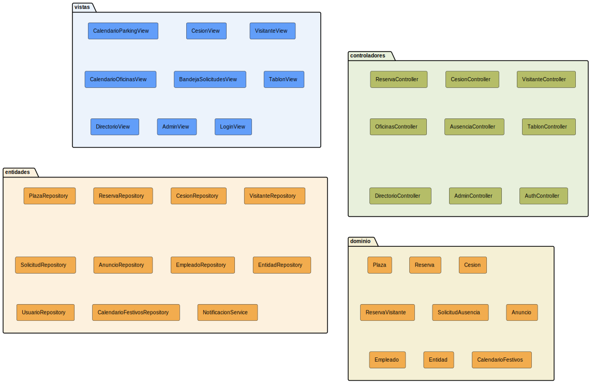
[Código fuente](../../modelosUML/puml/analisisClases.puml)

La agrupación por capas (y no por módulo funcional) es deliberada. Los módulos (`parking`, `oficinas`, `vacaciones`...) comparten el mismo patrón estructural: una vista, un controlador y un conjunto de repositorios. Representarlos como capas revela ese patrón común y evita la ilusión de que cada módulo es una isla arquitectónica independiente. La dependencia unidireccional (de arriba hacia abajo) garantiza que los módulos puedan activarse o desactivarse sin modificar el código de los demás (RNF-06).

### 3.1.2. Colaboración: reservarPlaza()

El caso de uso `reservarPlaza()` representa el flujo de reserva estándar: un empleado selecciona una fecha, consulta las plazas disponibles (tanto las libres como las cedidas) y confirma la reserva. El diagrama de colaboración muestra cómo las responsabilidades se distribuyen entre cuatro clases de análisis.

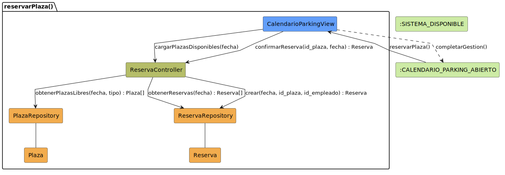
[Código fuente](../../modelosUML/puml/colabReservarPlaza.puml)

`CalendarioParkingView` recibe la solicitud desde el estado `CALENDARIO_PARKING_ABIERTO` del diagrama de contexto y se comunica exclusivamente con `ReservaController`. El controlador coordina dos operaciones de lectura (cargar plazas disponibles y obtener reservas existentes para detectar conflictos) delegando en `PlazaRepository` y `ReservaRepository` respectivamente. La confirmación de reserva sigue el mismo camino: la vista recoge la intención del empleado, el controlador valida y el repositorio persiste.

Las clases `Plaza` y `Reserva` son entidades puras del modelo del dominio que los repositorios gestionan. Esta separación (la vista no conoce las entidades, el controlador no conoce la base de datos) es la que permite cambiar la tecnología de persistencia sin que la lógica de negocio se entere.

### 3.1.3. Colaboración: cederPlaza()

La cesión es el caso de uso que distingue a un `Manager` de un `Empleado`. Solo el propietario de una plaza asignada puede cederla. La colaboración introduce un participante externo (Microsoft Graph) que no es un actor en el sentido RUP pero se prevé como apoyo para consultar el estado fuera de oficina del manager. Esta integración responde a la segunda decisión de diseño del capítulo 2: los directivos utilizan Outlook de forma habitual y el sistema debe aprovechar esa información para sugerir cesiones.

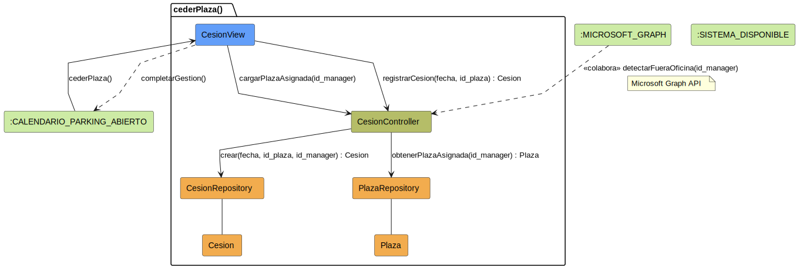
[Código fuente](../../modelosUML/puml/colabCederPlaza.puml)

`CesionView` recibe `cederPlaza()` desde el calendario de parking. El controlador primero recupera la plaza asignada del manager mediante `PlazaRepository` y después registra la cesión en `CesionRepository`. Microsoft Graph colabora en un segundo plano: el controlador puede consultar el estado fuera de oficina para sugerir la cesión, pero la decisión final siempre es del manager. La cesión intencional (nunca automática) fue la primera decisión de diseño del capítulo anterior y aquí se materializa como responsabilidad exclusiva de la vista, que solo ejecuta si el actor la solicita explícitamente.

### 3.1.4. Colaboración: gestionarSolicitudAusencia()

Este caso de uso materializa el flujo de aprobación en dos niveles (manager y RRHH) que constituye la tercera decisión de diseño del capítulo 2. La colaboración introduce un quinto participante: `NotificacionService`, responsable de informar al empleado y al siguiente nivel de aprobación cuando una solicitud cambia de estado.

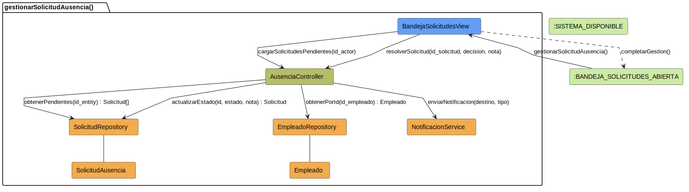
[Código fuente](../../modelosUML/puml/colabGestionarSolicitud.puml)

`BandejaSolicitudesView` presenta dos zonas (lista de solicitudes pendientes y panel de detalle) que el prototipo del capítulo 2 ya anticipaba. `AusenciaController` coordina la carga inicial consultando `SolicitudRepository` por las pendientes del actor y `EmpleadoRepository` por los datos del solicitante. La resolución (aprobar o rechazar) actualiza el estado de la solicitud y dispara la notificación correspondiente.

La lógica de dos niveles no requiere dos controladores distintos: el mismo `AusenciaController` valida si el actor tiene potestad para resolver en el nivel correspondiente. Manager aprueba en primer nivel; RRHH valida en segundo. Esta decisión evita duplicar la lógica de carga y notificación y es coherente con el principio de composición sobre herencia.

### 3.1.5. Colaboración: registrarVisitante()

`registrarVisitante()` es el único caso de uso que genera una interacción con una persona externa al sistema (el visitante) mediante el envío de un correo de confirmación. La colaboración muestra esta dependencia con el sistema externo Resend, que actúa como colaborador de la capa de aplicación.

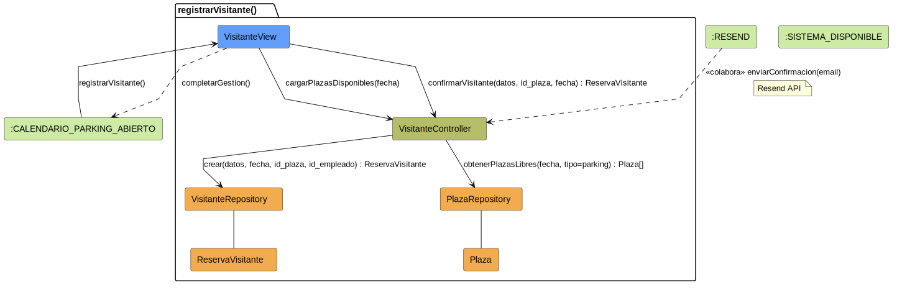
[Código fuente](../../modelosUML/puml/colabRegistrarVisitante.puml)

`VisitanteView` recoge los datos del visitante y la fecha de la visita. El controlador consulta las plazas de parking disponibles (reutilizando `PlazaRepository` del módulo de parking) y persiste la reserva en `VisitanteRepository`. Resend colabora enviando el correo de confirmación al visitante. La vista no sabe que se ha enviado un correo; el controlador no sabe cómo se envía. Esa separación permite cambiar el proveedor de email sin tocar la lógica de negocio.

### 3.1.6. Patrones de análisis identificados

Del análisis de los treinta y cinco casos de uso del sistema emergen cuatro patrones recurrentes que se repiten por grupo de entidades y que guían la transición al diseño.

| Patrón                 | Casos de uso representativos                        | Característica                                                                   |
| ---------------------- | --------------------------------------------------- | -------------------------------------------------------------------------------- |
| **Apertura**           | `abrirCalendarioParking()`, `abrirDirectorio()`     | Vista presenta lista; controlador coordina carga; repositorio devuelve entidades |
| **El delgado**         | `crearAnuncio()`, `solicitarAusencia()`             | Vista mínima; creación rápida; transferencia inmediata a edición                 |
| **El gordo**           | `reservarPlaza()`, `cederPlaza()`, `editarPerfil()` | Vista completa; sesión continua; validación en múltiples pasos                   |
| **Eliminación segura** | `cancelarReserva()`, `cancelarCesion()`             | Confirmación explícita; validación de dependencias; transición de vuelta         |

El patrón de apertura aparece en todos los módulos y es la puerta de entrada a las operaciones CRUD. El delgado aplica la filosofía C→U: crear con datos mínimos y transferir automáticamente a edición para completar. El gordo se reserva para las operaciones que requieren múltiples campos o validaciones encadenadas (como la reserva, que debe verificar conflictos de fecha, tipo de plaza y entidad). La eliminación segura nunca borra físicamente: transita el estado de la entidad a cancelada y mantiene la trazabilidad.

## 3.2. Transición al diseño

El análisis describe qué hace el sistema sin atarse a una tecnología concreta. El diseño responde a cómo se materializa esa descripción en un stack específico. La tabla siguiente documenta la correspondencia entre cada clase de análisis y su contraparte de diseño, junto con la decisión técnica que la motiva y el requisito no funcional que la justifica.

| Clase de análisis              | Clase de diseño                      | Decisión técnica                                       | RNF asociado   |
| ------------------------------ | ------------------------------------ | ------------------------------------------------------ | -------------- |
| `*View`                        | `*Page` (Next.js Server Component)   | Renderizado en servidor para SEO y carga inicial       | RNF-01, RNF-05 |
| `*Controller`                  | Server Action (`src/lib/actions/`)   | Mutaciones sin endpoint REST; validación Zod integrada | RNF-04, RNF-06 |
| `*Repository`                  | Query function (`src/lib/queries/`)  | Funciones Drizzle puras; sin ORM mágico                | RNF-07         |
| `AuthController`               | `src/lib/auth/` (Auth.js + helpers)  | JWT sobre credenciales; guardas de rol en capa app     | RNF-03, RNF-04 |
| `NotificacionService`          | `src/lib/email/` (Resend SDK)        | Email transaccional; templates React                   | RNF-08         |
| `CalendarioFestivosRepository` | `src/lib/calendar/calendar-utils.ts` | Utilidades puras sin dependencia de BD                 | RNF-06         |

La decisión más relevante es la elección de Server Actions sobre una API REST tradicional. En una SPA convencional, cada `Controller` de análisis se materializaría como un endpoint HTTP. Next.js App Router permite que las mutaciones sean funciones de servidor que el cliente invoca directamente, eliminando la capa de serialización REST y la duplicación de tipos entre cliente y servidor. La validación ocurre en el borde del sistema (al entrar la petición, mediante Zod) y una vez dentro el código confía en los tipos. Esta decisión responde a RNF-01 (las operaciones deben responder en menos de 2 segundos) y RNF-04 (la autorización se gestiona en la capa de aplicación).

La persistencia sobre PostgreSQL autoalojado (no sobre un servicio cloud como Supabase) responde a RNF-07: el sistema no debe depender de un proveedor concreto. Drizzle ORM actúa como capa de acceso a datos con tipado inferido del esquema, sin generación de código ni migraciones mágicas.

## 3.3. Disciplina de diseño

### 3.3.1. Arquitectura del sistema

El diagrama de arquitectura sigue el modelo C4 de contenedores: muestra las personas que usan el sistema, los contenedores que lo componen, los sistemas externos con los que colabora y las relaciones entre ellos. La elección de C4 responde a la necesidad de un plano de despliegue independiente del detalle de implementación (el mismo diagrama serviría si el backend se reescribiera en otro lenguaje).

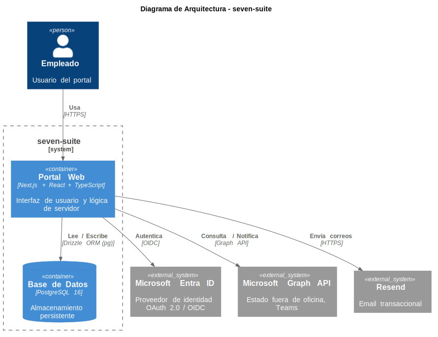
[Código fuente](../../modelosUML/puml/arquitectura.puml)

El portal web concentra las tres responsabilidades del servidor en un único contenedor Next.js: renderizar páginas, ejecutar mutaciones mediante Server Actions y exponer rutas de API para los callbacks de autenticación. PostgreSQL se comunica directamente con el portal mediante Drizzle ORM (sin capa intermedia de API REST) lo que elimina la sobrecarga de serialización y reduce la latencia de las operaciones de lectura (RNF-01). Los tres sistemas externos colaboran desde la capa de servidor, nunca desde el navegador: Entra ID gestiona la identidad, Graph API proporciona el estado fuera de oficina y las notificaciones por Teams, y Resend envía los correos transaccionales.

### 3.3.2. Diagrama de paquetes

El diagrama de paquetes muestra la organización del código fuente en cuatro niveles con estereotipos diferenciados y la dirección de las dependencias entre ellos.

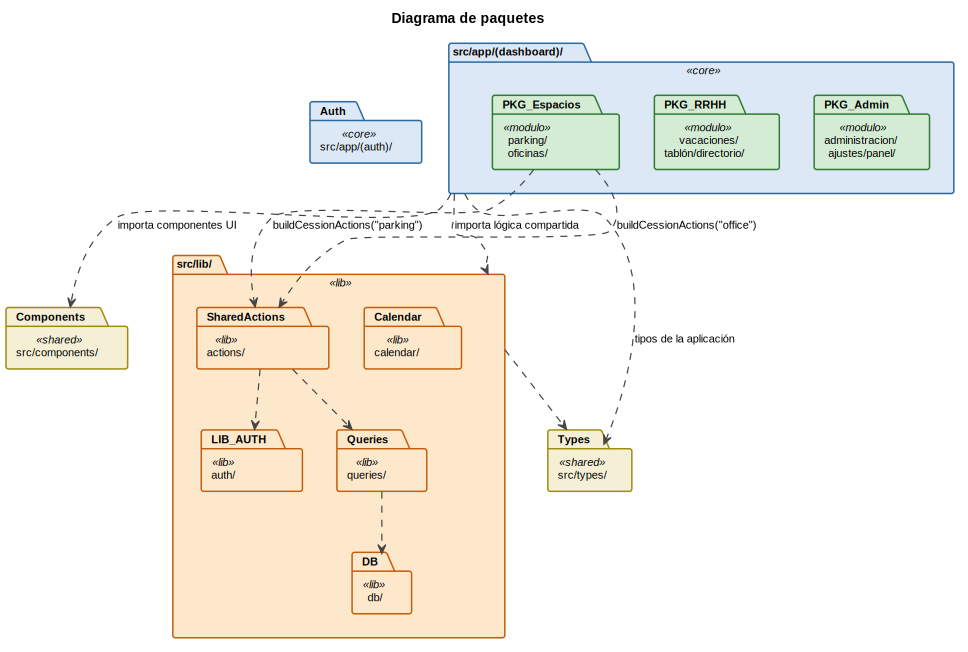
[Código fuente](../../modelosUML/puml/paquetes.puml)

Los módulos funcionales del dashboard (`parking/`, `oficinas/`, `vacaciones/`, `tablon/`, `administracion/`, `ajustes/` y `panel/`) dependen débilmente de `lib/` mediante flechas punteadas (importan lo que necesitan, pero `lib/` no sabe qué módulo lo consume). Los subpaquetes de `lib/` (`db/`, `auth/`, `queries/`, `actions/`, `calendar/`) tienen dependencias internas fuertes: las acciones dependen de las consultas y de la autenticación; las consultas dependen del cliente de base de datos. Los paquetes `src/components/` y `src/types/` son compartidos transversalmente por todos los módulos.

### 3.3.3. Diagrama de clases de diseño

El diagrama presenta las clases de diseño organizadas en los cinco paquetes que corresponden a las capas arquitectónicas del sistema. En lugar de enumerar todas las clases (lo que convertiría el diagrama en un catálogo) se muestran los representantes de cada capa con los métodos que definen su interfaz pública.

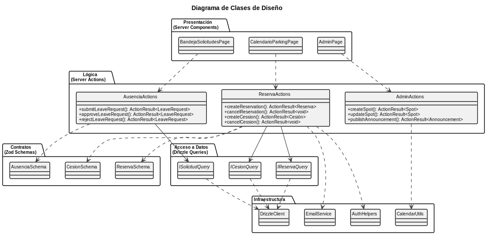
[Código fuente](../../modelosUML/puml/disenoClases.puml)

Las páginas de presentación dependen de las acciones mediante flechas punteadas (las conocen, pero no las contienen). Las acciones validan sus datos de entrada contra los esquemas Zod del paquete de contratos y delegan la persistencia en las interfaces del paquete de acceso a datos. La dependencia sobre interfaces en lugar de implementaciones concretas permite sustituir el motor de base de datos sin modificar la lógica de negocio. Los servicios de infraestructura son consumidos por las acciones, nunca directamente por las páginas.

### 3.3.4. Secuencia: reservarPlaza()

A diferencia del diagrama de colaboración del análisis (que muestra qué clases participan), la secuencia de diseño muestra la interacción real entre los componentes del sistema durante la ejecución de `reservarPlaza()`.

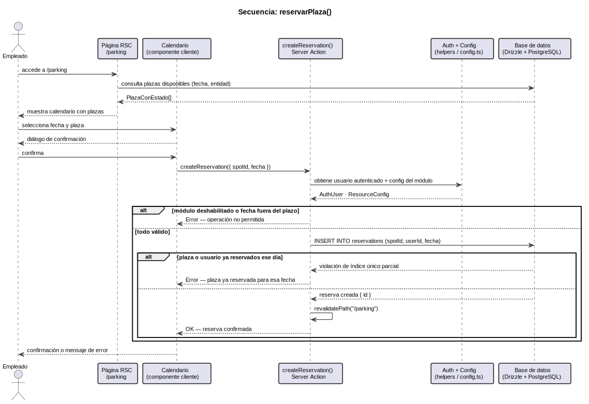
[Código fuente](../../modelosUML/puml/seqReservarPlaza.puml)

La página (un Server Component) resuelve la consulta de disponibilidad en el servidor antes de renderizar. Cuando el empleado confirma la reserva, la Server Action `createReservation` ejecuta tres pasos en secuencia: verifica la autenticación, valida los datos de entrada con el esquema Zod y persiste la reserva en PostgreSQL comprobando que no exista conflicto de fecha y plaza. La respuesta es siempre un `ActionResult<Reserva>` (unión discriminada entre éxito y error) que la página maneja sin recargar.

### 3.3.5. Secuencia: gestionarSolicitudAusencia()

El flujo de aprobación de ausencias es el más complejo del sistema. La secuencia muestra la interacción en el primer nivel (la aprobación por el manager). El segundo nivel (la validación por RRHH) sigue exactamente el mismo patrón: la misma Server Action `approveLeaveRequest`, invocada por un usuario con rol de RRHH, transita el estado de `aprobado_manager` a `aprobado`. Esta duplicación deliberada (un solo endpoint, dos niveles de autorización) evita tener dos acciones distintas para la misma operación conceptual y responde a la tercera decisión de diseño del capítulo 2.

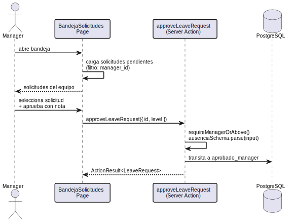
[Código fuente](../../modelosUML/puml/seqGestionarSolicitud.puml)

### 3.3.6. Diagrama de despliegue

El diagrama de despliegue muestra los nodos físicos del sistema y cómo se conectan. La aplicación Next.js se ejecuta en la infraestructura Edge de Vercel, lo que garantiza baja latencia para los usuarios distribuidos por toda España. PostgreSQL 16 se ejecuta en un servidor Linux propio bajo Docker Compose, accesible únicamente desde las Server Actions mediante conexión TCP directa.

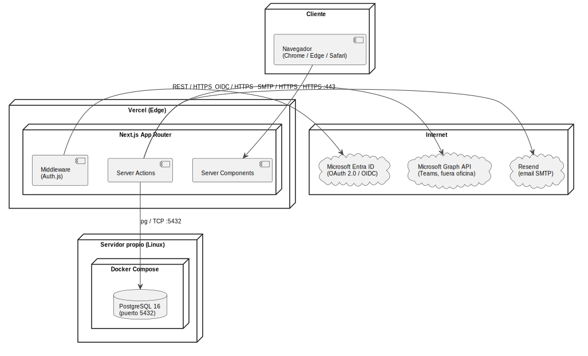
[Código fuente](../../modelosUML/puml/despliegue.puml)

La separación entre el servidor de aplicaciones y el de bases de datos (servidor propio) responde al RNF-02: si Vercel experimenta una degradación, la base de datos permanece intacta y accesible para otros consumidores. La ausencia de proveedores cloud para la persistencia (no hay RDS, no hay Supabase) materializa el RNF-07: el sistema puede migrarse a otra infraestructura sin reescribir consultas ni cambiar dependencias.
