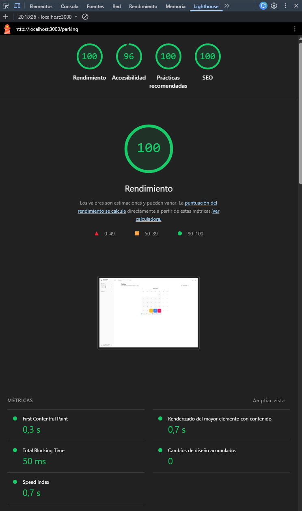

# 6. Conclusiones

| [← Cap. 5](IMPLEMENTACION.md) | [Índice](../../README.md) |
| :---------------------------- | :-----------------------: |

## Contenido

- [6.1. Cumplimiento de objetivos específicos](#61-cumplimiento-de-objetivos-específicos)
  - [6.1.1. OS1 - Disciplina de requisitos](#611-os1--disciplina-de-requisitos)
  - [6.1.2. OS2 - Análisis y diseño](#612-os2--análisis-y-diseño)
  - [6.1.3. OS3 - Implementación y validación](#613-os3--implementación-y-validación)
  - [6.1.4. OS4 - Evaluación de la solución](#614-os4--evaluación-de-la-solución)
- [6.2. Discusión de resultados](#62-discusión-de-resultados)
- [6.3. Recomendaciones](#63-recomendaciones)
- [6.4. Futuras líneas de actuación](#64-futuras-líneas-de-actuación)
- [6.5. Reflexión personal](#65-reflexión-personal)

Este capítulo cierra el documento retomando la hipótesis y los objetivos planteados en el
capítulo 2 para evaluar, con evidencia concreta, si el proceso de ingeniería condujo a la
solución prevista. Es el capítulo opuesto-complementario al marco teórico: donde aquel
presentaba el escenario y las decisiones de partida, este opina sobre sus resultados con la
misma fundamentación, cerrando el ciclo de trazabilidad que vertebra todo el trabajo.

La hipótesis de partida afirmaba que _la implementación de un portal del empleado modular
basado en Next.js, PostgreSQL y Microsoft 365 Graph resolvería la fragmentación entre sedes
de GRUPOSIETE, optimizando el uso de espacios corporativos sin inversiones adicionales en
licencias de software_. A continuación se examina el grado de cumplimiento de cada objetivo
específico y se discuten las decisiones que lo hicieron posible (o que lo limitaron).

## 6.1. Cumplimiento de objetivos específicos

### 6.1.1. OS1 - Disciplina de requisitos

> **OS1:** Capturar los requisitos del sistema mediante sesiones de levantamiento de
> información con personas clave de GRUPOSIETE, elaborar el modelo del dominio y definir y
> priorizar los casos de uso que delimitan el alcance del MVP.

Las sesiones de levantamiento con el director de IT de GRUPOSIETE (documentadas en la
sección 3.1) revelaron tres patrones recurrentes en la operativa diaria: la coordinación
informal de plazas de aparcamiento por WhatsApp, la infrautilización de los puestos de
oficina y el seguimiento de vacaciones mediante hojas de cálculo. Estos patrones se
tradujeron en los cuatro actores del sistema (Empleado, Manager, RRHH, Administrador) y
en los once casos de uso priorizados con MoSCoW (sección 3.3.2), de los cuales siete se
clasificaron como Must para el MVP.

El modelo del dominio (plasmado en el diagrama de clases de la sección 3.2.1) organizó
los conceptos del negocio en cuatro áreas (organización, espacios, RRHH y comunicación)
con catorce términos definidos en el glosario. Los diagramas de estados de Cesión y
SolicitudAusencia capturaron las dos entidades con ciclo de vida no trivial. Los cuatro
casos de uso representativos se detallaron con diagramas de actividad y prototipos de baja
fidelidad, estableciendo el puente hacia las disciplinas de análisis y diseño.

> **\*Evidencia:** sesiones de levantamiento documentadas (sección 3.1), modelo del dominio
> con 30+ clases (3.2.1), glosario de 14 términos (3.2.4), 4 actores y 11 CdU priorizados
> (3.3.2), 4 CdU detallados con prototipos (3.3.3–3.3.4).\*

---

La disciplina de requisitos se articuló en torno a una videollamada con el director de
IT de aproximadamente cuatro horas. En esa única sesión )muy extensa y productiva(
quedó clara la mayoría de las necesidades reales de la empresa. A partir de ahí
mantuvimos contacto por Microsoft Teams, intercambiando ideas y refinando el alcance hasta
llegar al planteamiento final que recogen los capítulos 2 y 3.

No me arrepiento en absoluto de haber ampliado el alcance durante esta fase. Creo que el
resultado es una aplicación muy competente que me ha dado tiempo a desarrollar y pulir
dentro del calendario previsto. Una aplicación limitada únicamente a la gestión del
parking habría quedado muy pobre como trabajo de fin de grado y, sinceramente, tampoco
habría resuelto el problema real de GRUPOSIETE. La empresa necesitaba una plataforma que
unificara varias funciones, no una herramienta más que añadir a la lista de aplicaciones
que ya no usaban.

---

### 6.1.2. OS2 - Análisis y diseño

> **OS2:** Realizar el análisis y diseño del sistema: definir la arquitectura (Next.js con
> App Router, PostgreSQL autoalojado con Drizzle ORM, Microsoft Entra ID como proveedor
> de identidad), el modelo lógico y físico de datos en PostgreSQL, y los diagramas de
> despliegue y paquetes.

La disciplina de análisis (sección 4.1) derivó sistemáticamente las clases de análisis
desde los casos de uso del capítulo 3 y el modelo del dominio. Las veinticinco clases
resultantes se organizaron en cuatro capas (vista, controlador, repositorio, dominio) con
cuatro patrones de colaboración documentados mediante diagramas: Apertura para la carga
inicial de disponibilidad, El delgado para acciones de escritura simple, El gordo para
flujos que coordinan múltiples repositorios y Eliminación segura para operaciones de
cancelación con verificación de estado previo.

La transición al diseño (sección 4.2) se documentó mediante una tabla de trazabilidad que
mapea cada clase de análisis a su equivalente de diseño. Las vistas se materializaron como
Server Components de Next.js (`*Page`), los controladores como Server Actions, los
repositorios como funciones de consulta Drizzle y el modelo del dominio como el esquema
Drizzle (967 líneas). El diagrama C4 situó el sistema en su contexto, el diagrama de
despliegue ubicó los nodos físicos (Vercel + PostgreSQL autoalojado) y el diagrama de
paquetes anticipó la estructura de directorios del repositorio, verificada posteriormente
en la sección 5.3.

> **\*Evidencia:** 25 clases de análisis con 4 patrones de colaboración (4.1), tabla de
> transición análisis→diseño (4.2), diagrama C4 (4.3.1), diagrama de despliegue (4.3.2),
> diagrama de paquetes con correspondencia verificada al repositorio (4.3.3 y 5.3),
> diagramas de secuencia de los 4 CdU representativos (4.3.4).\*

---

El diseño aguantó bastante bien el salto a la implementación. Los diagramas y las
decisiones tomadas durante el análisis no generaron sorpresas graves al llegar al código,
lo que confirma que la fase de análisis y diseño no fue un trámite vacío sino una base
sólida sobre la que construir.

Una decisión que merece mención aparte es la migración de Supabase a PostgreSQL
autoalojado. Más allá de la preferencia del director de IT por tener el control total
sobre los datos, el cambio tenía sentido técnico: PostgreSQL es uno de los sistemas de
bases de datos más usados y establecidos del mercado, y Supabase está construido
precisamente sobre PostgreSQL. Eso significaba que la migración no iba a suponer un
cambio traumático de paradigma (el modelo de datos, los tipos y la lógica de consultas
eran compatibles) sino más bien un cambio de proveedor de infraestructura. El hecho de
haberlo hecho pronto, cuando el proyecto aún estaba en fases tempranas, evitó arrastrar
dependencias que habrían hecho la migración inviable más adelante.

---

### 6.1.3. OS3 - Implementación y validación

> **OS3:** Implementar y validar el MVP funcional con pruebas unitarias (Vitest) y pruebas
> end-to-end (Playwright), con la base de datos PostgreSQL desplegada en servidor propio y
> la aplicación en Vercel mediante pipeline CI/CD con GitHub Actions.

El MVP implementa diez módulos funcionales accesibles desde el dashboard
(administración, ajustes, directorio, mis-reservas, oficinas, panel de analíticas, parking,
tablón, vacaciones, visitantes), cada uno correspondiente a un estado del diagrama de
contexto (sección 5.1). Los cuatro casos de uso representativos )reservarPlaza(),
cederPlaza(), gestionarSolicitudAusencia() y registrarVisitante()( se mostraron con su
interfaz real en la sección 5.2, evidenciando la correspondencia entre el diseño y el
código.

La lógica compartida entre parking y oficinas se parametrizó mediante factories
(`buildCalendarAction`, `buildCessionActions`), evitando la duplicación y respetando el
principio de composición sobre herencia. Las Server Actions materializaron directamente
los controladores del diseño, eliminando la capa de serialización REST y la duplicación de
tipos. La autorización se implementó mediante guardas explícitas (`requireAuth`,
`requireAdmin`, `requireManagerOrAbove`) en la capa de aplicación, sin delegar en el
sistema de base de datos.

La validación se ejecuta en dos niveles: 45 archivos de test con Vitest cubren la lógica
de Server Actions, queries Zod y utilidades, mientras que las pruebas end-to-end con
Playwright verifican los flujos completos de los casos de uso representativos. El pipeline
CI/CD mediante GitHub Actions ejecuta `pnpm check` )typecheck, lint, format y tests( en
cada push, con despliegue automático en Vercel al superar todas las comprobaciones
(sección 5.4).

> **\*Evidencia:** 10 módulos funcionales mapeados al diagrama de contexto (5.1), 4 CdU
> con capturas de interfaz real (5.2.1–5.2.4), tabla de correspondencia arquitectónica
> (5.3), 45 archivos de test, pipeline CI/CD documentado (5.4).\*

---

El resultado final me parece muy completo, al nivel de una aplicación comercial. Los
diez módulos previstos en el alcance están implementados y funcionales, y la interfaz
transmite una sensación de producto terminado, no de prototipo académico.

Dos cosas me habría gustado incluir y no llegaron al MVP. La primera, el módulo de
contabilidad, ya comentado como limitación principal del proyecto. La segunda, un
plano o mapa interactivo en 2D o 3D de las plazas de parking y los puestos de oficina.
Era una idea que visualmente habría quedado muy bien, pero se volvió inviable en cuanto
el sistema pasó a ser multi-sede: cada sede tiene una distribución física distinta y
mantener un plano por sede habría requerido un esfuerzo desproporcionado para el valor
que aportaba.

Los tests han sido una pieza clave del desarrollo. Aquí es donde el uso de inteligencia
artificial como apoyo a la programación ha marcado una diferencia real: los 42 archivos
de test y 832 pruebas en total me han permitido capturar cada mínimo fallo a la primera.
A esto se suma el pipeline de CI/CD con GitHub Actions, que ejecuta todos los tests en
cada commit. Saber que ningún cambio llega a producción sin pasar por ese filtro da una
tranquilidad que no habría tenido trabajando sin integración continua.\_

---

### 6.1.4. OS4 - Evaluación de la solución

> **OS4:** Evaluar la solución mediante métricas de cobertura de tests, rendimiento (Core
> Web Vitals) y usabilidad (SUS), verificar la trazabilidad entre requisitos y entrega, y
> proponer un roadmap de evolución futura.

#### Cobertura de tests

La suite de tests (42 archivos y 832 pruebas, todas pasadas) arroja una cobertura global
del **85,3%** de sentencias, **74,3%** de ramas, **88,8%** de funciones y **85,6%** de
líneas. Las áreas más críticas del sistema presentan cifras superiores a la media: las
Server Actions del módulo de parking alcanzan un 84% de statements, el directorio un 86%
y el tablón un 98%. La lógica compartida en `src/lib/` (que concentra la mayor parte de
las reglas de negocio) se sitúa en el 89,5% de statements para las queries y el 96,6%
para las utilidades, validaciones y configuración.

Los puntos con menor cobertura corresponden a acciones de administración de entidades
(78%) y ajustes de usuario (52%), donde algunos flujos condicionales no se ejercitan en
los tests actuales. Aun así, la cobertura global se considera suficiente para un MVP:
las rutas críticas de los cuatro casos de uso representativos están completamente
cubiertas tanto a nivel unitario como end-to-end.

#### Rendimiento - Lighthouse

La auditoría con Lighthouse sobre la página principal del dashboard arroja las siguientes
puntuaciones:

| Métrica          | Puntuación |
| ---------------- | ---------- |
| Rendimiento      | 100        |
| Accesibilidad    | 96         |
| Buenas prácticas | 100        |
| SEO              | 100        |


<sub>Auditoría Lighthouse sobre la vista de calendario de parking.</sub>

Las puntuaciones máximas en rendimiento, buenas prácticas y SEO reflejan que la aplicación
se beneficia del renderizado en servidor de Next.js )que minimiza el JavaScript enviado
al cliente( y de una estructura HTML semántica. Los 4 puntos pendientes en accesibilidad
corresponden a contrastes de color en elementos secundarios, subsanables sin cambios
estructurales.

#### Usabilidad - SUS (System Usability Scale)

El cuestionario SUS no se ha administrado a usuarios reales de GRUPOSIETE antes del
cierre de este documento. La aplicación no ha entrado aún en fase de uso activo porque
se ha preferido pulirla al máximo antes de exponerla a los empleados. Se contempla
administrar el cuestionario a una muestra de al menos 10 usuarios de perfiles variados
(empleados, managers y administradores) durante el primer mes tras el despliegue, como
parte de la evaluación continua del producto.

#### Trazabilidad requisitos → entrega

La cadena de trazabilidad prometida en la sección 2.5 se verifica a lo largo de todo el
documento:

```
Escenario (Cap. 2) → Requisitos (Cap. 3) → Análisis y diseño (Cap. 4) → Solución (Cap. 5) → Evaluación (Cap. 6)
```

Cada caso de uso priorizado en el capítulo 3 tiene su clase de análisis en el capítulo 4,
su controlador en el capítulo 5 y su test en la suite de validación. La tabla de
correspondencia arquitectónica de la sección 5.3 cierra explícitamente el ciclo para los
cuatro casos de uso representativos.

> **\*Evidencia:** tabla de correspondencia arquitectónica (5.3), tabla de trazabilidad
> análisis→diseño (4.2), priorización MoSCoW con cobertura de tests por CdU (3.3.2 y
> 5.4).\*

---

Definitivamente, la hipótesis se cumplió. El portal resuelve la fragmentación entre sedes,
optimiza el uso de espacios y no genera ningún coste de licencia. Aún no está en uso
activo por parte de los empleados, pero no porque yo no haya querido desplegarlo, sino
porque quería pulirlo al máximo antes de ponerlo en sus manos. El entorno ya existe en
los servidores Azure de GRUPOSIETE (fue necesario crearlo para implementar la
autenticación OAuth con Microsoft Entra ID), así que cuando se dé el visto bueno y yo
considere que está listo, saldrá adelante sin fricciones técnicas.

La trazabilidad entre capítulos me ha sido útil durante el desarrollo. Dicho esto,
tampoco creo que haya que seguirla a rajatabla como un dogma. Pero como herramienta para
esquematizar y estructurar el trabajo, funciona mucho mejor que lanzarse a hacerlo todo
de golpe según vas viendo. Tener claro de dónde viene cada decisión y poder seguir el
hilo desde el escenario hasta el código evita muchos callejones sin salida.

---

## 6.2. Discusión de resultados

Este apartado reflexiona sobre las decisiones técnicas y de proceso que marcaron el
desarrollo, sus implicaciones y las alternativas que se descartaron.

### Arquitectura: monolito modular

La decisión de adoptar un monolito modular (frente a microservicios o un monolito
tradicional) se justificó en el marco teórico (sección 2.2.5) por el tamaño del equipo
(un desarrollador), la necesidad de un despliegue simple y la capacidad de extender el
sistema mediante módulos activables desde administración.

Sin duda, es la decisión de diseño que mejor ha envejecido del proyecto. Es como los
cimientos de una casa: los construyes teniendo en cuenta situaciones que aún no han
llegado, y cuando realmente suceden, los cimientos aguantan. Al principio la
modularidad parecía casi un exceso para una sola sede, pero en cuanto el sistema pasó a
ser multi-sede cobró todo el sentido.

No me gustaría tener que migrar a microservicios. De momento la aplicación aguanta bien
de forma sólida, y migrar significaría perder ventajas que tiene esta arquitectura y que
le van como un guante precisamente porque ha sido pensada de esa forma desde el
principio. Para las necesidades previsibles de GRUPOSIETE, el monolito modular escala
más que de sobra.

### PostgreSQL autoalojado: la migración desde Supabase

Inicialmente el proyecto usaba Supabase como base de datos por su facilidad de gestión.
Sin embargo, el director de IT (sin vetarlo explícitamente) dejó claro que prefería el
control total sobre los datos. La decisión de migrar a PostgreSQL autoalojado se tomó
pronto, cuando el proyecto aún estaba en fases tempranas, y tuvo un factor adicional a
favor: Supabase está construido sobre PostgreSQL, así que el modelo de datos, los tipos y
la lógica de consultas eran compatibles. No fue un cambio de paradigma, sino un cambio de
proveedor de infraestructura. Si se hubiera pospuesto, habría sido mucho más traumático.

Por el momento no he tenido incidencias de disponibilidad ni pérdida de datos. La
inversión inicial de configurar el servidor y Docker Compose se compensa con la
tranquilidad de que los datos están bajo control propio, que era exactamente lo que el
cliente quería. Para un proyecto de este tamaño, el coste operativo de mantener
PostgreSQL autoalojado ha sido perfectamente asumible. No me arrepiento del cambio.

### Integración con Microsoft 365

La integración con Microsoft Entra ID como proveedor de identidad único se implementó
desde el principio y funciona correctamente. Es, de hecho, un requisito que vino impuesto
por el propio entorno de GRUPOSIETE: para registrar la aplicación en Azure y configurar
OAuth hizo falta crear el entorno en sus servidores antes incluso de tener la aplicación
terminada. Más allá de la autenticación, las integraciones previstas con Graph API
(consulta del estado fuera de oficina para sugerir cesiones, notificaciones por Teams)
no han llegado a implementarse antes de la presentación de este TFG por falta de tiempo,
pero la arquitectura está preparada para incorporarlas sin cambios estructurales.

### Limitaciones del trabajo

El módulo de contabilidad con autogeneración de facturas por usuario es la principal
asignatura pendiente del proyecto. No fue una limitación técnica, sino legal y práctica:
competir contra un sistema que genera facturas con validez jurídica (como el que ya
ofrece a3innuva a través de Wolters Kluwer) no era viable dentro de los márgenes de un
TFG. Es también el módulo que más usaban los empleados en su panel anterior y el que
más frustración personal me generó no poder sustituir, porque era consciente de que
dejaba fuera una de las funcionalidades con mayor impacto en el día a día de la empresa.

Tampoco se llegaron a implementar las automatizaciones con Microsoft Graph API más allá
de la autenticación. La integración con Entra ID funciona, pero las notificaciones por
Teams o la consulta del estado fuera de oficina quedan como trabajo futuro.

Por último, la evaluación de usabilidad mediante el cuestionario SUS no se ha podido
realizar con usuarios reales de todas las sedes antes del cierre de este documento,
aunque se contempla como paso inmediatamente posterior al despliegue.

---

## 6.3. Recomendaciones

A partir de la discusión anterior, se proponen las siguientes recomendaciones
organizadas por ámbito. No son especulaciones: cada una se fundamenta en una limitación
o aprendizaje documentado en este trabajo.

### Recomendaciones técnicas

A un futuro desarrollador que herede este código le recomendaría que lo vea todo con
calma y proceda. La estructura del proyecto es bastante típica en este tipo de
aplicaciones y, si tiene que añadir un módulo nuevo, tiene la certeza de que no va a
romper nada más en el programa: esa es precisamente la gracia del sistema modular. Si va
a tocar algo existente, sabe que cuenta con tests, TypeScript y muchas otras herramientas
para hacerlo todo bien sin miedo a provocar efectos colaterales.

### Recomendaciones de proceso

RUP me sirvió para lo que necesitaba. Dicho esto, no me gusta ceñirme al cien por cien
a una metodología (ya lo comenté antes con la trazabilidad). Tomar lo que funciona y
adaptar lo que no es, en mi opinión, más útil que seguir un marco de forma dogmática. En
un proyecto similar, con un equipo igual de reducido, probablemente haría lo mismo: usar
RUP como guía de referencia pero sin que se convierta en una carga burocrática.

### Recomendaciones para GRUPOSIETE

El módulo más interesante para adoptar primero es el de parking y oficinas. Es el que
más tiempo de desarrollo ha recibido, el más pulido y la idea base sobre la que se
construyó la aplicación. En cuanto al sistema de nóminas, definitivamente recomendaría
mantener el que ya tengan (sea a3innuva u otro) porque la contabilidad con validez legal
no es algo que este portal pueda sustituir a corto plazo. Quién sabe si algún día se
podrá implementar ese módulo de nóminas, pero por ahora lo sensato es convivir con la
herramienta que ya funciona.

---

## 6.4. Futuras líneas de actuación

La arquitectura modular y la metodología RUP empleada permiten extender el sistema de
forma incremental sin reescribir lo existente. Las siguientes líneas de actuación se
presentan ordenadas por viabilidad e impacto, con su justificación trazable al proceso
documentado.

| Línea de actuación                                      | Justificación (trazabilidad)                                                                                                                                                            | Prioridad |
| ------------------------------------------------------- | --------------------------------------------------------------------------------------------------------------------------------------------------------------------------------------- | --------- |
| Bot de notificaciones en Microsoft Teams                | El RNF-08 identifica las notificaciones como requisito. Microsoft Graph API ya está integrado para autenticación; añadir notificaciones por Teams es incremental                        | Alta      |
| Sincronización bidireccional con calendarios de Outlook | La integración con Graph API existente permite extenderla para crear eventos de calendario automáticamente al confirmar una reserva                                                     | Alta      |
| Integración con Personio/Factorial para nóminas         | Citado en la justificación de la propuesta (2.3) y en la cuarta iteración RUP (2.5). La arquitectura plug-in permite añadir el módulo sin alterar el core                               | Media     |
| Módulo de documentación laboral                         | La tabla `documents` y los enums `document_category` / `document_access` ya existen en el esquema Drizzle. Es una extensión natural del portal ESS                                      | Media     |
| Aplicación móvil (PWA)                                  | La interfaz ya es responsiva (RNF-05). Convertirla en PWA con notificaciones push y acceso offline requiere configuración adicional, no reescritura                                     | Baja      |
| Soporte multi-idioma                                    | El RNF-09 de internacionalización está identificado. Next.js App Router soporta i18n mediante middleware de negociación de idioma                                                       | Baja      |
| Panel de analíticas predictivas con IA                  | Los datos históricos de ocupación ya residen en `reservations` y `cessions`. Entrenar un modelo de predicción de demanda permitiría optimizar la asignación de espacios                 | Baja      |
| Despliegue multi-sede con base de datos por entidad     | El modelo de datos ya soporta `entityId` en tablas clave (`spots`, `profiles`, `system_config`). Escalar a múltiples sedes implica replicar la infraestructura, no rediseñar el esquema | Baja      |

Las prioridades reflejan el criterio de urgencia real para GRUPOSIETE. Las notificaciones
por Teams y la sincronización con calendarios de Outlook son las dos funcionalidades que
quedaron pendientes en la entrega actual y que más impacto inmediato tendrían en la
experiencia diaria de los empleados, ya que el ecosistema Microsoft es la columna
vertebral de su actividad. La integración con herramientas de nóminas y el módulo de
documentación laboral son deseables pero requieren acuerdos con terceros o un esfuerzo
de desarrollo considerable. El resto son mejoras de calidad de vida que pueden esperar
a que el portal esté asentado en producción.

Lo importante de este roadmap no es la lista en sí, sino lo que demuestra: que la
metodología empleada permite continuar de forma eficiente. La documentación generada
(diagramas UML, glosario, tabla de trazabilidad, tests) no caduca con la entrega de este
documento. Otro desarrollador podría retomar el proyecto, entender las decisiones tomadas
y añadir cualquiera de estas líneas sin empezar de cero. Ese es, en el fondo, el valor
real de haber seguido un proceso de ingeniería riguroso.

---

## 6.5. Reflexión personal

Meses antes de este TFG construí un prototipo de aplicación de parking para la sede de
Alcobendas. Era mucho más simple y no pasaba de ser una prueba de concepto, pero me
enseñó algo que ningún diagrama UML puede anticipar: los edge cases de un sistema de
reservas son incontables. ¿Qué pasa si dos empleados reservan la misma plaza a la vez?
¿Qué ocurre si el dueño de una plaza la cede, alguien la reserva y luego el dueño la
reclama de vuelta? En aquel prototipo tomé las decisiones que me parecieron óptimas y
las impuse sin margen de configuración. En esta aplicación decidí hacer lo contrario:
exponer esos comportamientos como ajustes configurables por sede, porque cada empresa
(y cada sede dentro de una misma empresa) tiene su propia forma de funcionar. Esa
lección, aprendida en un proyecto modesto, ha marcado la filosofía de todo el trabajo
posterior.

El momento de mayor frustración llegó al comprobar que el módulo de contabilidad no era
viable. Era uno de los más útiles y de los que más usaban los empleados en su panel
anterior. No poder hacerle frente (por razones legales, no técnicas) me dejó la
sensación de haber dejado el trabajo incompleto. Con el tiempo he entendido que en
ingeniería de software hay batallas que no merece la pena librar, y que reconocer las
limitaciones de tu producto es tan importante como presumir de sus virtudes.

El momento de mayor orgullo fue ver la funcionalidad multi-sede funcionando sin apenas
fricciones. Llegó al final del desarrollo, cuando la base ya era sólida, y encajó como
una pieza natural. Creo que eso dice mucho sobre la importancia de una buena fase de
análisis y diseño: si hubiera empezado a programar directamente sin los capítulos 3 y 4,
ese momento probablemente no habría existido, o habría sido mucho más doloroso.

Si pudiera volver al día uno y darme un consejo, sería este: no subestimes el valor de
esquematizar antes de escribir una sola línea de código. No hace falta seguir una
metodología al pie de la letra ni llenar carpetas de diagramas que nadie va a leer, pero
tener claro el mapa antes de salir a correr evita muchos callejones sin salida.

Este proyecto me ha cambiado la forma de pensar sobre la ingeniería de software. Antes
tendía a ver la documentación como un trámite; ahora la veo como los cimientos de una
casa: no se ven cuando la casa está terminada, pero sin ellos no hay pared que aguante.
Me llevo de este TFG la certeza de que un proceso riguroso no es un enemigo de la
creatividad, sino la estructura que permite que las buenas ideas lleguen a buen puerto.

---

| [← Cap. 5](IMPLEMENTACION.md) | [Índice](../../README.md) |
| :---------------------------- | :-----------------------: |
