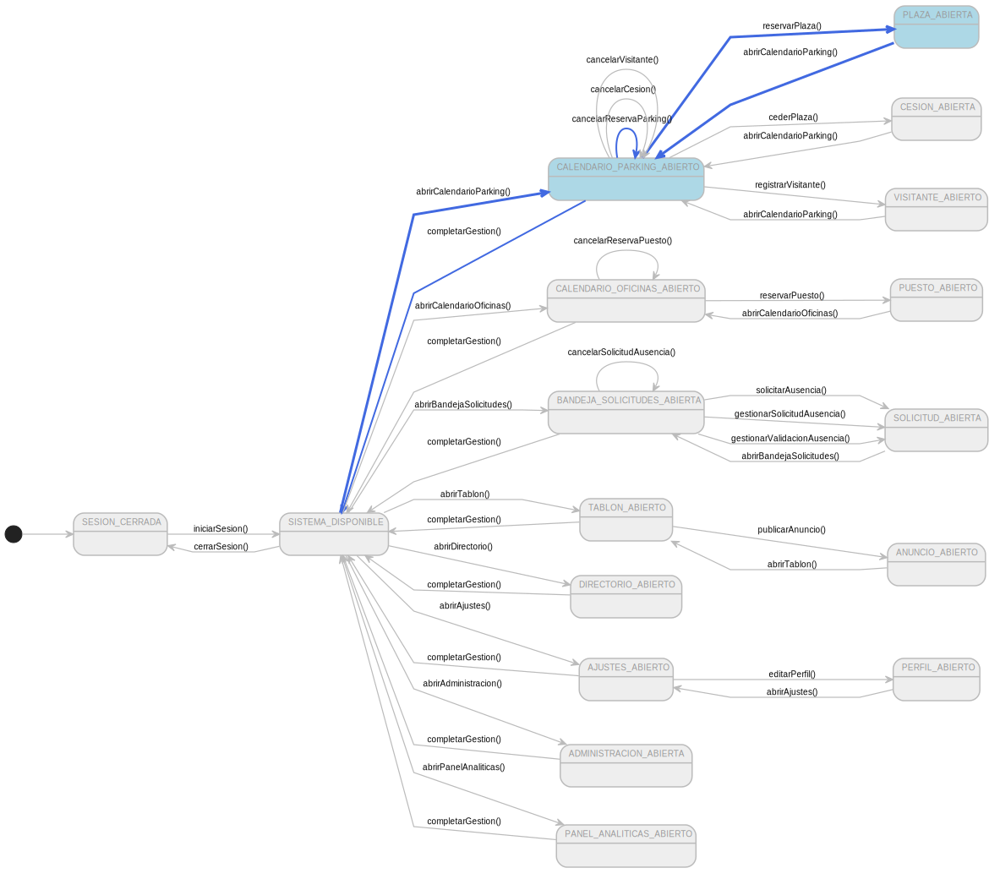
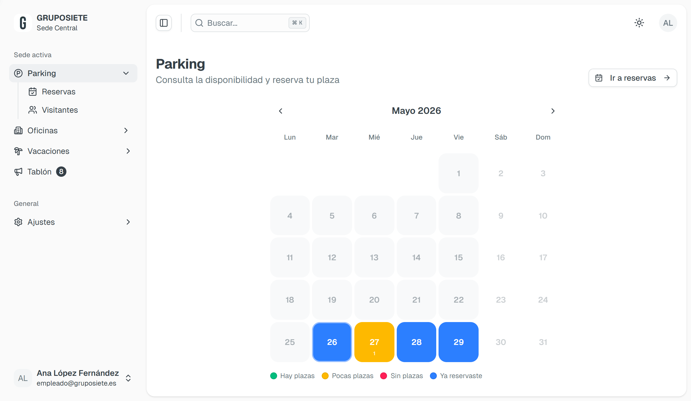
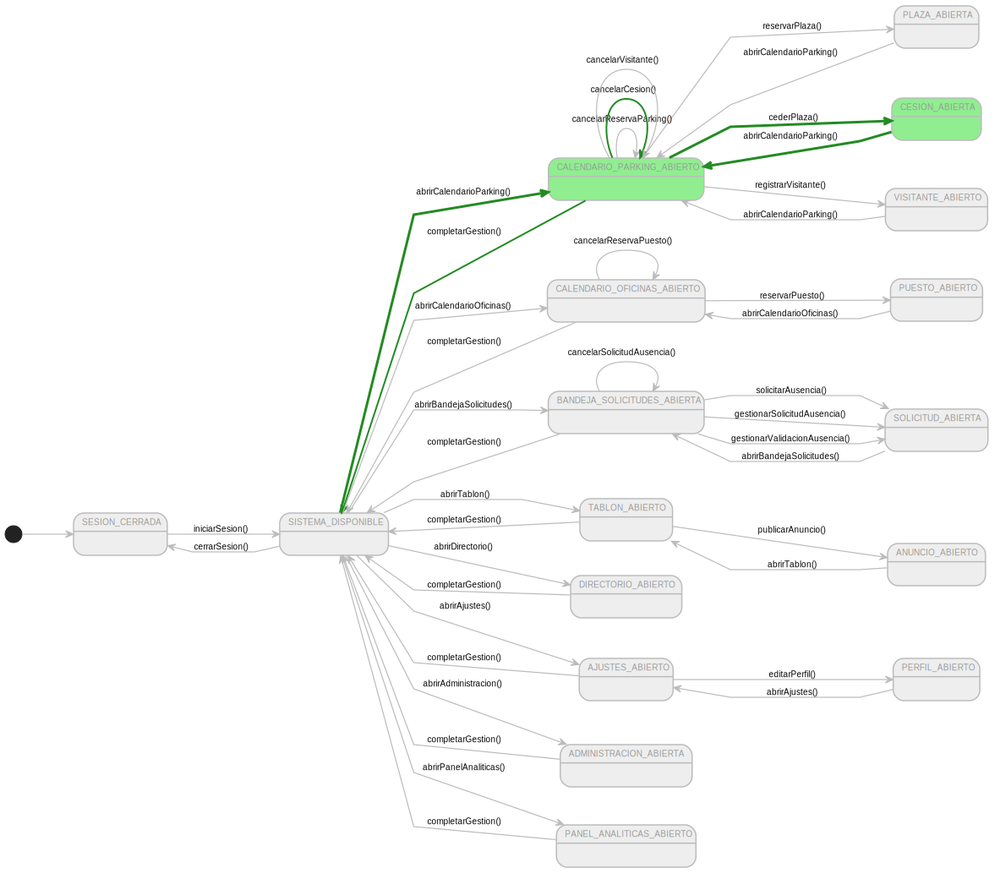
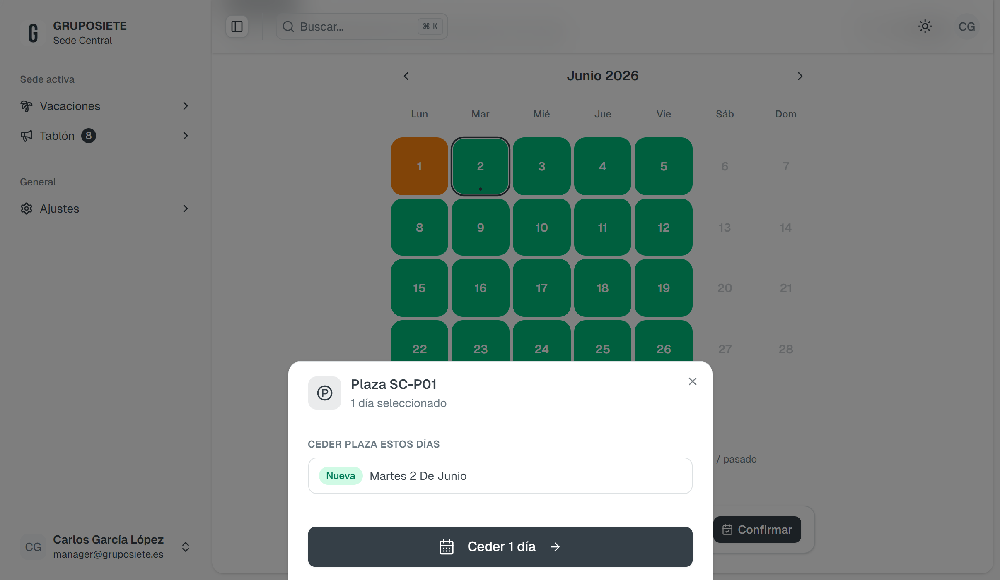
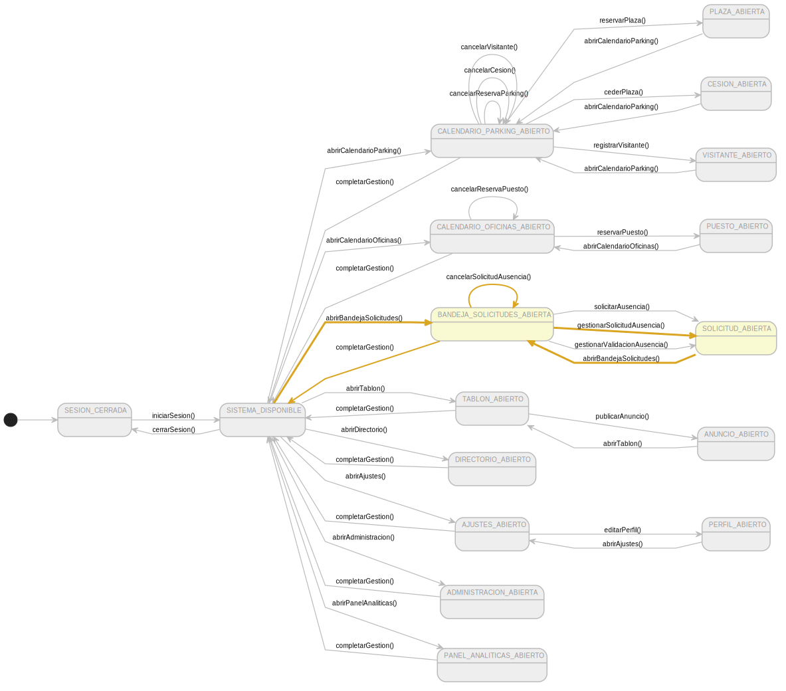
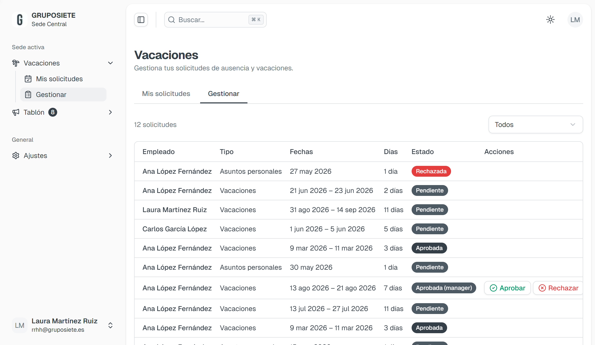
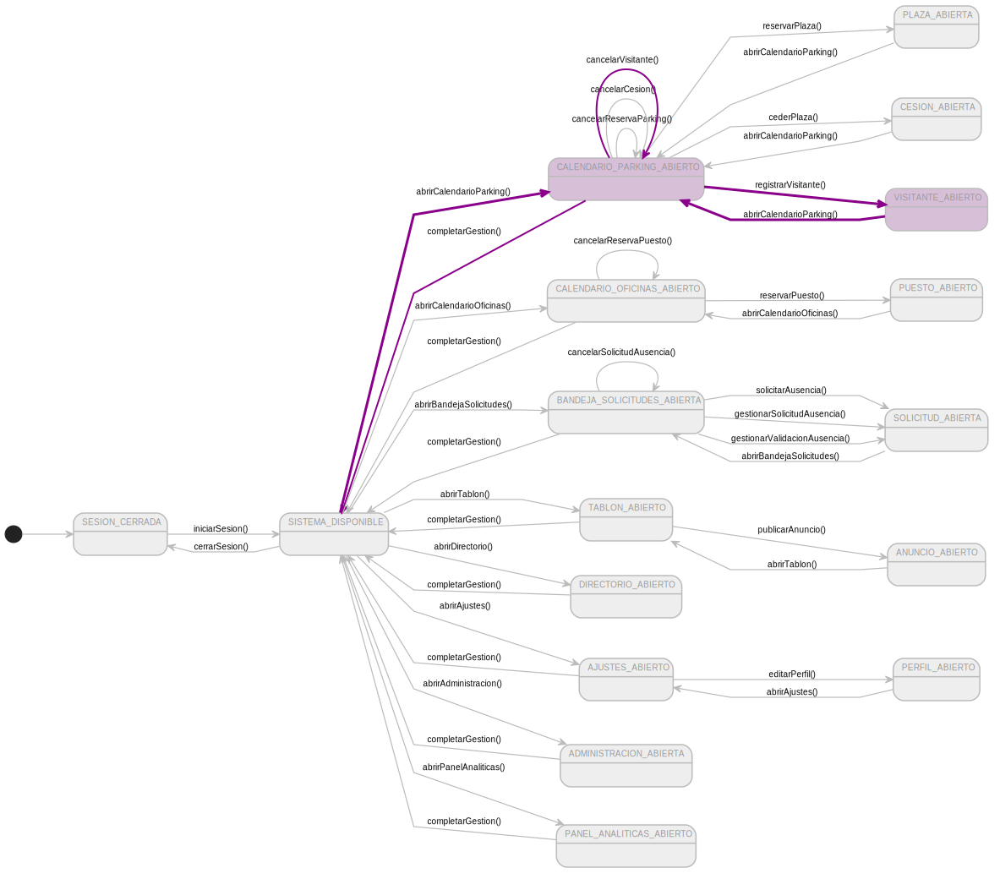
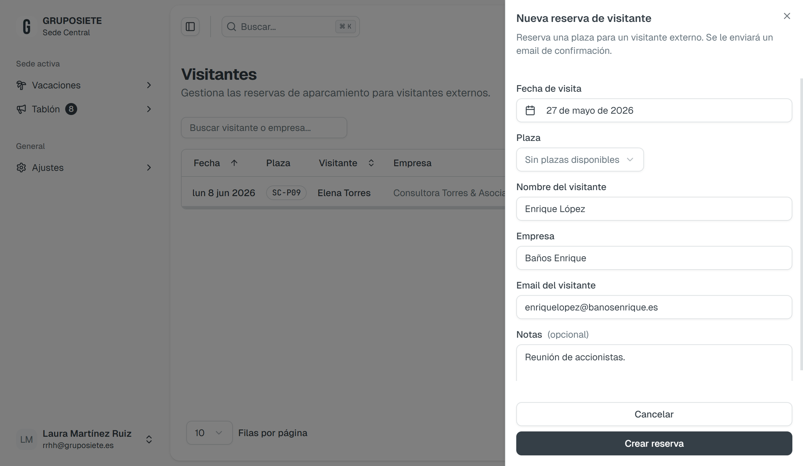
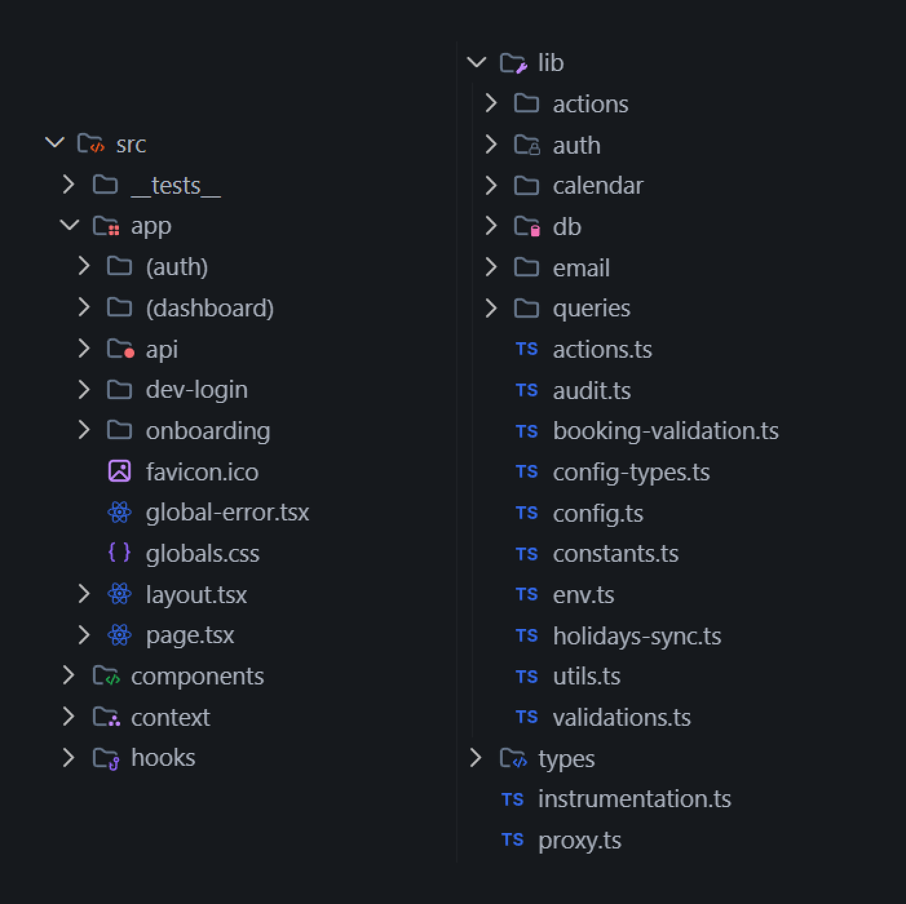
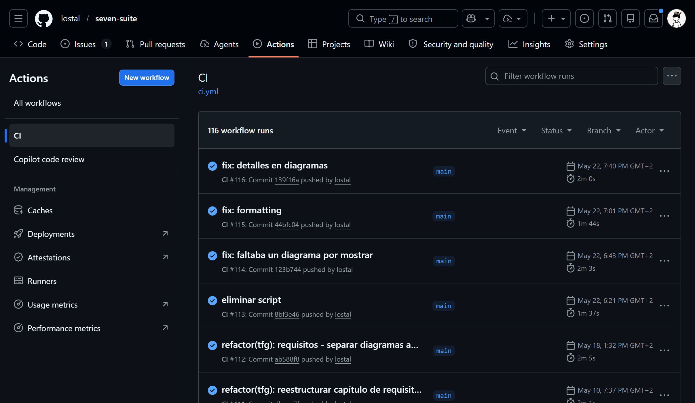

# 4. Descripción de la solución

| [← Cap. 3](ANALISIS_DISENO.md) | [Índice](../../README.md) | [Cap. 5 →](CONCLUSIONES.md) |
| :----------------------------- | :-----------------------: | --------------------------: |

## Contenido

- [4.1. Mapa de navegación](#41-mapa-de-navegación)
- [4.2. Casos de uso representativos](#42-casos-de-uso-representativos)
  - [4.2.1. reservarPlaza()](#421-reservarplaza)
  - [4.2.2. cederPlaza()](#422-cederplaza)
  - [4.2.3. gestionarSolicitudAusencia()](#423-gestionarsolicitudausencia)
  - [4.2.4. registrarVisitante()](#424-registrarvisitante)
- [4.3. Correspondencia arquitectónica](#43-correspondencia-arquitectónica)
- [4.4. Validación](#44-validación)

El objetivo de este capítulo es presentar la solución implementada como la materialización
directa del análisis y diseño documentados en los capítulos 2 y 3. La navegación sigue el
diagrama de contexto; cada pantalla corresponde a un estado y cada acción del usuario a una
transición. Los cuatro casos de uso representativos se muestran con su interfaz real,
evidenciando que el código es un refinamiento del diseño sin alterar el esqueleto
arquitectónico.

## 4.1. Mapa de navegación

El diagrama de contexto (introducido en la sección 2.3.5 como una máquina de estados)
sirve como mapa de navegación de la aplicación. Cada estado representa una vista del portal
y cada transición un caso de uso que conduce al usuario de una vista a otra.

[Código fuente](../../modelosUML/puml/contexto.puml)

La tabla siguiente traza la correspondencia entre los estados del contexto, las rutas del
portal y el módulo funcional que las implementa.

| Estado del contexto           | Ruta                           | Módulo          |
| ----------------------------- | ------------------------------ | --------------- |
| `SESION_CERRADA`              | `/login`                       | Auth (Entra ID) |
| `SISTEMA_DISPONIBLE`          | `/parking`                     | Hub central     |
| `CALENDARIO_PARKING_ABIERTO`  | `/parking`                     | Parking         |
| `PLAZA_ABIERTA`               | `/parking` (modal de reserva)  | Parking         |
| `CESION_ABIERTA`              | `/parking` (panel de cesión)   | Parking         |
| `VISITANTE_ABIERTO`           | `/parking/visitantes`          | Parking         |
| `CALENDARIO_OFICINAS_ABIERTO` | `/oficinas`                    | Oficinas        |
| `PUESTO_ABIERTO`              | `/oficinas` (modal de reserva) | Oficinas        |
| `BANDEJA_SOLICITUDES_ABIERTA` | `/vacaciones`                  | Vacaciones      |
| `SOLICITUD_ABIERTA`           | `/vacaciones` (detalle)        | Vacaciones      |
| `TABLON_ABIERTO`              | `/tablon`                      | Tablón          |
| `DIRECTORIO_ABIERTO`          | `/directorio`                  | Directorio      |
| `AJUSTES_ABIERTO`             | `/ajustes`                     | Ajustes         |
| `ADMINISTRACION_ABIERTA`      | `/administracion`              | Administración  |
| `PANEL_ANALITICAS_ABIERTO`    | `/panel`                       | Panel           |

La transición `completarGestion()` unifica el retorno desde cualquier módulo al estado
`SISTEMA_DISPONIBLE`, materializada como la barra de navegación lateral del dashboard.
Esta decisión responde al requisito de usabilidad RNF-05: la navegación es responsiva y
funciona en dispositivos móviles sin aplicación nativa.

## 4.2. Casos de uso representativos

Se muestran a continuación los cuatro casos de uso detallados en el capítulo 2 y analizados
en el capítulo 3. Para cada uno se presenta, en formato de dos columnas, el diagrama de
contexto con los estados y transiciones del caso de uso resaltados (el resto atenuado en gris
para guiar el foco) junto con la captura de la interfaz real implementada.

### 4.2.1. reservarPlaza()

El caso de uso `reservarPlaza()` representa el flujo estándar de reserva: un empleado
selecciona una fecha, consulta las plazas disponibles y confirma. La vista de calendario
materializa el patrón de apertura identificado en el análisis (sección 3.1.6): el
controlador `ReservaController` coordina la carga de disponibilidad delegando en
`PlazaRepository` y `ReservaRepository`, y la Server Action `createReservation` valida
y persiste.

| Contexto                                                               | Solución                                                |
| ---------------------------------------------------------------------- | ------------------------------------------------------- |
|  |  |
| [Código fuente](../../modelosUML/puml/contextoReserva.puml) | Vista de calendario con reserva              |

La confirmación de reserva ejecuta la Server Action `createReservation` que verifica
autenticación, valida con Zod y comprueba conflictos de fecha y plaza antes de persistir en
PostgreSQL. La respuesta (un `ActionResult<Reserva>`) permite a la página manejar el
resultado sin recargar, tal como anticipaba el diagrama de secuencia de la sección 3.3.4.

### 4.2.2. cederPlaza()

`cederPlaza()` distingue al actor `Manager` del `Empleado`: solo el propietario de una
plaza asignada puede cederla. La implementación respeta la primera decisión de diseño del
capítulo 2: la cesión es intencional (nunca automática) y requiere la acción explícita del
manager. Microsoft Graph colabora consultando el estado fuera de oficina para sugerir la
cesión, materializando la segunda decisión de diseño.

| Contexto                                                              | Solución                                         |
| --------------------------------------------------------------------- | ------------------------------------------------ |
|     |       |
| [Código fuente](../../modelosUML/puml/contextoCesion.puml) | Panel de cesión con selector de fecha |

### 4.2.3. gestionarSolicitudAusencia()

Este caso de uso materializa el flujo de aprobación en dos niveles (la tercera decisión
de diseño) mediante una única Server Action `approveLeaveRequest` que distingue el nivel
de autorización por el rol del actor. La interfaz presenta dos zonas (lista de solicitudes
pendientes y panel de detalle) que el prototipo de baja fidelidad del capítulo 2 ya
anticipaba. La lógica de notificación delega en `NotificacionService`, que envía
confirmaciones por correo electrónico a través de Resend.

| Contexto                                                                              | Solución                                                  |
| ------------------------------------------------------------------------------------- | --------------------------------------------------------- |
|  |  |
| [Código fuente](../../modelosUML/puml/contextoSolicitud.puml)              | Bandeja con panel de aprobación/rechazo        |

### 4.2.4. registrarVisitante()

`registrarVisitante()` es el único caso de uso que genera interacción con una persona
externa al sistema. La implementación reutiliza `PlazaRepository` del módulo de parking
(evitando duplicar lógica de disponibilidad) y delega el envío del correo de confirmación
en Resend. La vista no sabe que se envió un correo; el controlador no sabe cómo se envía:
esa separación, documentada en el análisis (sección 3.1.5), permite cambiar el proveedor
de email sin tocar la lógica de negocio.

| Contexto                                                                      | Solución                                                  |
| ----------------------------------------------------------------------------- | --------------------------------------------------------- |
|  |    |
| [Código fuente](../../modelosUML/puml/contextoVisitante.puml)      | Formulario de registro con datos del visitante |

## 4.3. Correspondencia arquitectónica

La estructura del código refleja fielmente la arquitectura definida en el capítulo 3. La
tabla siguiente documenta la correspondencia entre cada clase de análisis, su contraparte
de diseño y el archivo del repositorio que la materializa.

| Clase de análisis       | Clase de diseño                       | Archivo en el repositorio                         |
| ----------------------- | ------------------------------------- | ------------------------------------------------- |
| `CalendarioParkingView` | `ParkingPage` (Server Component)      | `src/app/(dashboard)/parking/page.tsx`            |
| `ReservaController`     | `createReservation` (Server Action)   | `src/lib/actions/parking.ts`                      |
| `PlazaRepository`       | `getAvailableSpots` (Query)           | `src/lib/queries/spots.ts`                        |
| `ReservaRepository`     | `getReservationsByDate` (Query)       | `src/lib/queries/reservations.ts`                 |
| `CesionView`            | `ParkingPage` (panel de cesión)       | `src/app/(dashboard)/parking/page.tsx`            |
| `CesionController`      | `createCession` (Server Action)       | `src/lib/actions/parking.ts`                      |
| `AusenciaController`    | `approveLeaveRequest` (Server Action) | `src/lib/actions/vacaciones.ts`                   |
| `VisitanteView`         | `VisitantesPage` (Server Component)   | `src/app/(dashboard)/parking/visitantes/page.tsx` |
| `VisitanteController`   | `registerVisitor` (Server Action)     | `src/lib/actions/parking.ts`                      |
| `AuthController`        | `auth.ts` + `helpers.ts`              | `src/lib/auth/`                                   |
| `NotificacionService`   | `sendEmail` (Resend SDK)              | `src/lib/email/`                                  |

El diagrama de paquetes del capítulo 3 anticipó esta organización: los módulos funcionales
del dashboard (`parking/`, `oficinas/`, `vacaciones/`, etc.) dependen de `lib/` mediante
flechas punteadas (importan lo que necesitan, pero `lib/` no sabe qué módulo lo consume).
La imagen siguiente muestra la correspondencia entre ese diagrama y la estructura real del
repositorio, evidenciando que cada paquete lógico tiene un directorio físico que lo
materializa sin desviaciones.

| Diagrama de paquetes                                            | Estructura del repositorio                            |
| --------------------------------------------------------------- | ----------------------------------------------------- |
|       |  |
| [Código fuente](../../modelosUML/puml/paquetes.puml) | Correspondencia paquetes → directorios     |

Las Server Actions son la materialización directa de los controladores: el cliente las
invoca como funciones de servidor, eliminando la capa de serialización REST y la
duplicación de tipos entre cliente y servidor (RNF-01, RNF-04). La validación ocurre
en el borde del sistema mediante Zod; una vez dentro, el código confía en los tipos
inferidos del esquema de Drizzle.

## 4.4. Validación

La disciplina de pruebas del ciclo RUP se materializa en dos niveles. Las pruebas
unitarias con Vitest cubren la lógica de las Server Actions, las queries y las
validaciones Zod. Las pruebas end-to-end con Playwright verifican los flujos completos
de los cuatro casos de uso representativos desde la perspectiva del usuario.

| Nivel      | Herramienta | Cobertura                              |
| ---------- | ----------- | -------------------------------------- |
| Unitarias  | Vitest      | `src/lib/actions/`, `src/lib/queries/` |
| End-to-end | Playwright  | Flujos de los 4 CdU representativos    |

El pipeline CI/CD mediante GitHub Actions ejecuta `pnpm check` (typecheck, lint, format y
tests) en cada push a la rama principal. El despliegue en Vercel se activa automáticamente
al superar todas las comprobaciones, garantizando que solo el código validado llega a
producción.

| Pipeline                         | Verificación                                |
| -------------------------------- | ------------------------------------------- |
|  | `pnpm check` → `pnpm build` → Vercel deploy |

La cobertura de tests, el pipeline de integración continua y el despliegue automatizado
conforman la evidencia de que el MVP responde a los requisitos del capítulo 2 y sigue
fielmente el diseño del capítulo 3, cerrando así el ciclo de trazabilidad que el capítulo
5 verificará formalmente.
