# 2. Requisitos

| [← Cap. 1](MARCO_TEORICO.md) | [Índice](../../README.md) | [Cap. 3 →](ANALISIS_DISENO.md) |
| :--------------------------- | :-----------------------: | -----------------------------: |

## Contenido

- [2.1. Sesiones de levantamiento de información](#21-sesiones-de-levantamiento-de-información)
- [2.2. Modelo del dominio](#22-modelo-del-dominio)
  - [2.2.1. Diagrama de clases del dominio](#221-diagrama-de-clases-del-dominio)
  - [2.2.2. Diagrama de objetos del dominio](#222-diagrama-de-objetos-del-dominio)
  - [2.2.3. Diagramas de estados](#223-diagramas-de-estados)
  - [2.2.4. Glosario](#224-glosario)
- [2.3. Disciplina de requisitos](#23-disciplina-de-requisitos)
  - [2.3.1. Actores del sistema](#231-actores-del-sistema)
  - [2.3.2. Casos de uso](#232-casos-de-uso)
  - [2.3.3. Detalle de casos de uso representativos](#233-detalle-de-casos-de-uso-representativos)
  - [2.3.4. Prototipos de interfaz](#234-prototipos-de-interfaz)
  - [2.3.5. Diagrama de contexto](#235-diagrama-de-contexto)
- [2.4. Requisitos no funcionales](#24-requisitos-no-funcionales)

El objetivo de esta iteración es delimitar el alcance del sistema mediante la construcción del modelo del dominio y la especificación de los casos de uso del MVP. El resultado es el acuerdo formal entre cliente y desarrollador sobre lo que el sistema debe hacer, expresado en artefactos UML trazables al código y a los entregables posteriores.

## 2.1. Sesiones de levantamiento de información

El levantamiento de requisitos se realizó mediante videollamadas con el perfil clave de GRUPOSIETE: el director de IT de la empresa que además trabaja en la sede de Alcobendas.

Las sesiones pusieron de manifiesto tres patrones de uso recurrentes. El primero es la coordinación informal de plazas de parking mediante WhatsApp: los directivos comunican su ausencia al grupo general y cualquier empleado responde en hilo libre, sin registro, sin confirmación y sin visibilidad del estado real de ocupación. El segundo es la gestión de puestos de oficina: dado que la sede tiene 240 m² y no todos los empleados acuden a diario, existe un problema crónico de infrautilización algunos días. El tercero es la gestión de ausencias: las solicitudes de vacaciones se tramitan directamente a través de un Excel (los responsables se encargan de pasar a RRHH las vacaciones de los empleados de su sede).

De las sesiones emergieron tres decisiones de diseño que condicionan el resto del análisis. Primera: la cesión de plazas de parking debe ser una operación intencional del propietario, no una liberación automática, para evitar conflictos de acceso. Segunda: el sistema debe integrarse con Microsoft 365 y preparar la detección del estado fuera de oficina, ya que los directivos utilizan Outlook de forma habitual. Tercera: el flujo de aprobación de ausencias debe contemplar dos niveles (manager y RRHH) para respetar la estructura organizativa actual de la empresa.

## 2.2. Modelo del dominio

El modelo del dominio construye una abstracción de la realidad de GRUPOSIETE independiente de cualquier decisión de implementación. Sus artefactos (diagrama de clases, diagrama de objetos, diagrama de estados y glosario) recogen el vocabulario compartido entre cliente y desarrollador a lo largo de todo el proyecto. Las relaciones entre clases emplean cuatro tipos semánticos: composición (la parte no existe sin el todo), agregación (el todo contiene las partes pero estas tienen identidad propia), uso (dependencia transitoria sin propiedad) y asociación (relación entre pares independientes).

### 2.2.1. Diagrama de clases del dominio

El diagrama organiza las entidades en cuatro áreas conceptuales: organización, espacios, recursos humanos y comunicación.

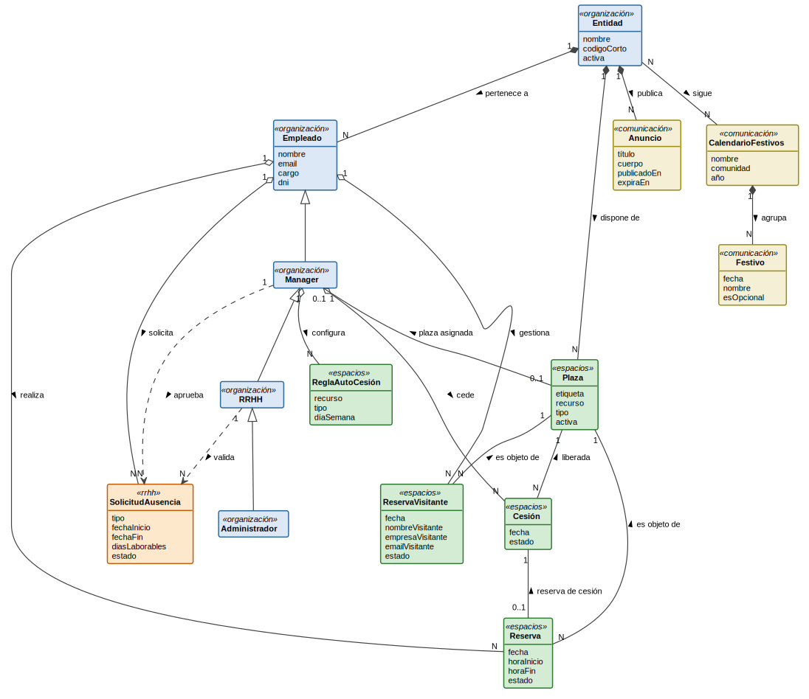
[Código fuente](../../modelosUML/puml/dominioClases.puml)

El área de **organización** refleja la jerarquía de roles mediante herencia: `Empleado` es el rol base; `Manager` lo extiende añadiendo la capacidad de tener una plaza asignada y de ceder; `RRHH` extiende a `Manager` y añade la validación de ausencias en segundo nivel; `Administrador` tiene acceso pleno a la configuración del sistema. La `Entidad` (cada sede o empresa del grupo) mantiene una relación de composición con `Empleado` y con `Plaza`, ya que tanto los empleados como los espacios físicos pertenecen a una entidad concreta. La plaza asignada se modela como asociación entre `Manager` y `Plaza`.

El área de **espacios** gira en torno a la entidad `Plaza`, que unifica conceptualmente las plazas de aparcamiento y los puestos de oficina mediante el atributo `recurso`. La `Reserva` se vincula con `Empleado` y con `Plaza` mediante agregación. La `Cesión` es agregada por `Manager` y está asociada a la `Plaza` liberada; cuando queda en estado disponible, cualquier empleado puede generar sobre ella una `Reserva`, estableciendo así la asociación `reserva de cesión`. La `ReglaAutoCesión` es agregada por `Manager` y automatiza el proceso cuando el propietario está fuera de la oficina o en días concretos de la semana. La `ReservaVisitante`, agregada por `Empleado` y asociada a `Plaza`, cubre el caso de uso de parking para personas externas.

El área de **RRHH** contiene la `SolicitudAusencia`. El empleado la agrega al solicitarla, mientras que la aprobación y la validación se modelan como uso por parte de `Manager` y `RRHH` respectivamente.

El área de **comunicación** incluye el `Anuncio` (en composición con `Entidad`) y el `CalendarioFestivos`, compuesto por `Festivos` individuales mediante composición y asociado a cada entidad para el registro correcto de días laborables.

### 2.2.2. Diagrama de objetos del dominio

El diagrama de objetos valida el modelo de clases de la sección anterior mostrando un escenario concreto de la sede de Alcobendas con instancias reales del dominio. Cada objeto ejemplifica una de las relaciones documentadas en el diagrama de clases (composición, agregación, uso y asociación), lo que permite verificar que el modelo puede representar sin inconsistencias las situaciones reales descritas en las sesiones de levantamiento de requisitos.

El escenario recoge la interacción típica de un día laborable en la sede: el manager Juan García, propietario de la plaza P-12, la cede el 15 de junio mediante una `Cesión`; la empleada María López reserva esa misma plaza sobre la cesión; María también gestiona una `ReservaVisitante` para un cliente externo y solicita vacaciones de verano que Laura Sánchez (RRHH) debe validar en segundo nivel. El `Anuncio` corporativo, el `CalendarioFestivos` y sus `Festivos` asociados, y la `ReglaAutoCesion` de los viernes completan la escena. Las catorce instancias cubren la totalidad de las relaciones del modelo del dominio.

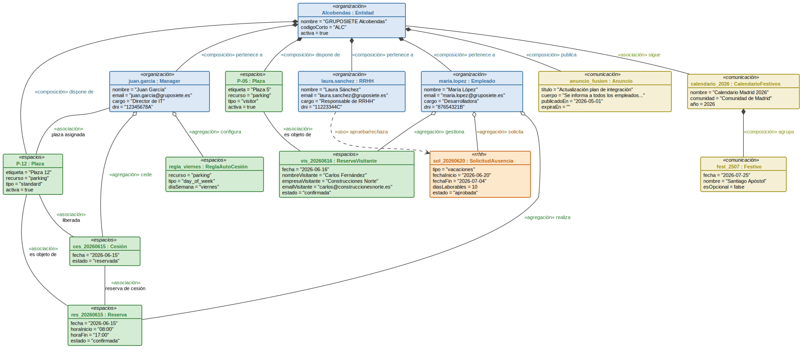
[Código fuente](../../modelosUML/puml/dominioObjetos.puml)

### 2.2.3. Diagramas de estados

Se documentan los ciclos de vida de las tres entidades con comportamiento dinámico no trivial.

**Reserva**. Su ciclo de vida es simple: se crea en estado confirmada y solo puede transitar a cancelada. La restricción de unicidad (una plaza, un día, una reserva confirmada) se garantiza a nivel de base de datos mediante índices parciales. Al tratarse de una entidad con dos estados y una única transición, su comportamiento se describe aquí en el glosario en lugar de dedicarle un diagrama de estados.

**Cesión**. Nace en estado disponible cuando el propietario la cede. Transita a reservada en cuanto un empleado genera una reserva sobre ella, o a cancelada si el propietario la retira antes de que sea reservada. Una cesión reservada también puede cancelarse, lo que libera la reserva asociada.

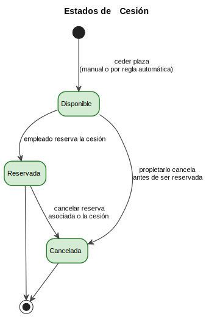
[Código fuente](../../modelosUML/puml/estadosCesion.puml)

**SolicitudAusencia**. Es el ciclo más complejo del sistema. Una solicitud nace como pendiente y requiere aprobación secuencial: primero el manager directo del empleado y después el equipo de RRHH. En cualquier punto anterior a la aprobación final el empleado puede cancelarla; el manager o RRHH pueden rechazarla en su respectivo nivel.

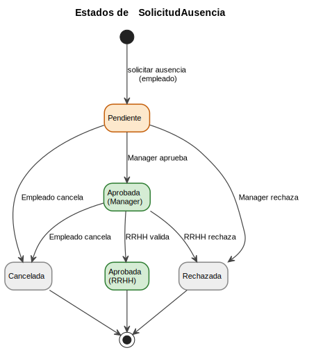
[Código fuente](../../modelosUML/puml/estadosSolicitudAusencia.puml)

### 2.2.4. Glosario

| Término                | Definición                                                                                                                                                                          |
| ---------------------- | ----------------------------------------------------------------------------------------------------------------------------------------------------------------------------------- |
| **Entidad**            | Cada una de las sedes o empresas que conforman GRUPOSIETE. Cada entidad puede activar o desactivar módulos de forma independiente.                                                  |
| **Empleado**           | Usuario autenticado del sistema. Su rol determina las acciones que puede realizar.                                                                                                  |
| **Manager**            | Rol que extiende a Empleado. Dispone de una plaza asignada de forma permanente, puede cederla a otros empleados y aprueba las solicitudes de ausencia de su equipo en primer nivel. |
| **RRHH**               | Rol que extiende a Manager. Valida las solicitudes de ausencia en segundo nivel y gestiona la publicación de anuncios corporativos.                                                 |
| **Administrador**      | Rol que extiende a RRHH. Tiene acceso pleno a la configuración del sistema: gestiona entidades, plazas, usuarios y la activación de módulos.                                        |
| **Plaza**              | Espacio físico reservable: plaza de aparcamiento o puesto de trabajo en oficina.                                                                                                    |
| **Plaza asignada**     | Plaza vinculada de forma permanente a un Manager concreto. Solo este puede cederla.                                                                                                 |
| **Reserva**            | Registro que vincula a un empleado con una plaza en una fecha y, opcionalmente, una franja horaria.                                                                                 |
| **Cesión**             | Liberación voluntaria de una plaza asignada por su propietario para que otros empleados la reserven en una fecha concreta.                                                          |
| **ReglaAutoCesión**    | Configuración que automatiza la cesión cuando el propietario está fuera de la oficina (detectado vía Microsoft 365) o en días fijos de la semana.                                   |
| **ReservaVisitante**   | Reserva de plaza de parking gestionada por un empleado para una persona externa a GRUPOSIETE. Incluye los datos del visitante y genera una notificación por correo electrónico.     |
| **Hot desking**        | Modelo de trabajo en el que los puestos de oficina no están asignados de forma permanente sino que se reservan dinámicamente según disponibilidad.                                  |
| **SolicitudAusencia**  | Petición formal de ausencia laboral que sigue un flujo de aprobación en dos niveles: manager y RRHH.                                                                                |
| **Visitante**          | Persona externa a GRUPOSIETE para la que un empleado gestiona una reserva de parking. No tiene acceso al portal y recibe únicamente un correo de confirmación.                      |
| **Anuncio**            | Comunicación interna publicada por RRHH o Administrador, con ámbito de entidad o global, y con fecha de expiración opcional.                                                        |
| **Festivo**            | Día no laborable registrado en un CalendarioFestivos. Puede ser de ámbito nacional, autonómico o local, y marcarse como opcional.                                                   |
| **CalendarioFestivos** | Conjunto de días festivos asociado a una entidad para excluirlos del cómputo de días laborables y de la disponibilidad de reservas.                                                 |
| **Módulo**             | Funcionalidad activable o desactivable de forma independiente por entidad desde el panel de administración.                                                                         |

## 2.3. Disciplina de requisitos

### 2.3.1. Actores del sistema

La jerarquía de actores sigue una cadena de herencia en la que cada nivel añade capacidades al anterior. Los diagramas a continuación presentan dicha herencia junto con los casos de uso que inicia cada actor, distribuidos en tres vistas temáticas.

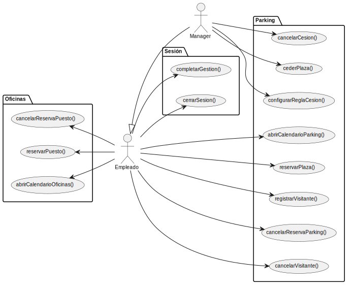
[Código fuente](../../modelosUML/puml/casosUso.puml)

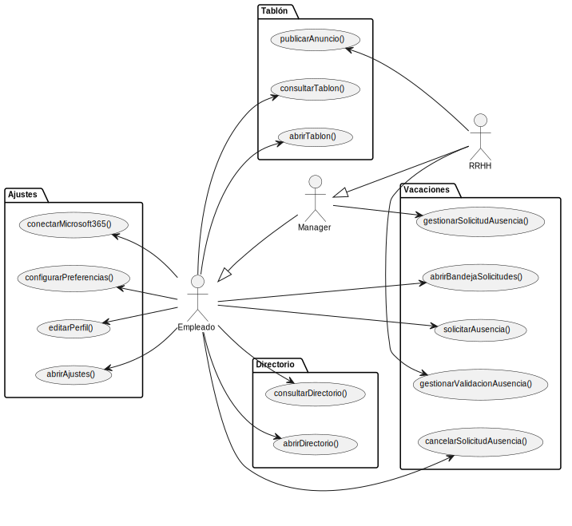
[Código fuente](../../modelosUML/puml/casosUsoPersonas.puml)

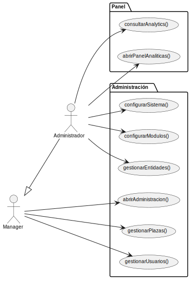
[Código fuente](../../modelosUML/puml/casosUsoAdmin.puml)

| Actor             | Tipo              | Descripción                                                                                                                   |
| ----------------- | ----------------- | ----------------------------------------------------------------------------------------------------------------------------- |
| **Empleado**      | Primario          | Usuario base del sistema. Realiza reservas, solicita ausencias y consulta información.                                        |
| **Manager**       | Primario          | Extiende a Empleado. Dispone de plaza asignada, puede cederla y aprueba solicitudes de ausencia de su equipo en primer nivel. |
| **RRHH**          | Primario          | Extiende a Manager. Valida solicitudes de ausencia en segundo nivel y publica anuncios.                                       |
| **Administrador** | Primario          | Extiende a RRHH. Gestiona entidades, plazas, usuarios y la configuración global del sistema.                                  |
| **Visitante**     | Secundario pasivo | Persona externa sin acceso al portal. Recibe un correo de confirmación cuando un empleado registra una visita en su nombre.   |

El sistema interactúa con dos servicios externos que no son actores en el sentido de iniciar casos de uso, sino colaboradores de la capa de aplicación: **Microsoft Entra ID** como proveedor de identidad (OAuth 2.0/OIDC) y **Microsoft Graph API** como integración prevista para estado fuera de oficina y notificaciones por Teams.

### 2.3.2. Casos de uso

Los tres diagramas de la sección anterior presentan la totalidad de los casos de uso del sistema, agrupados por dominio (espacios, personas y administración) y vinculados a los actores que los inician mediante la herencia visible en cada vista.

El desarrollo del MVP se organizó en incrementos sucesivos priorizando los casos de uso mediante MoSCoW (Must, Should, Could, Won't). El primer incremento abordó la autenticación mediante Entra ID y la estructura base del portal (`cerrarSesion()`). El segundo implementó el módulo de parking con reservas, cesiones y gestión de visitantes; el tercero añadió el módulo de oficinas con reserva de puestos y franjas horarias. El cuarto incremento incorporó el módulo de vacaciones con el flujo completo de aprobación en dos niveles, seguida del tablón de anuncios y el directorio de empleados. El quinto incremento cubrió el panel de administración (gestión de plazas, usuarios, entidades y configuración del sistema) junto con el módulo de ajustes. El último incremento integró el panel de analíticas para administradores.

### 2.3.3. Detalle de casos de uso representativos

Se detallan a continuación cuatro casos de uso que cubren los flujos más representativos del sistema: el flujo estándar de reserva, la lógica específica de cesión, la gestión de solicitudes de ausencia por parte del manager y la gestión de visitantes con notificación externa.

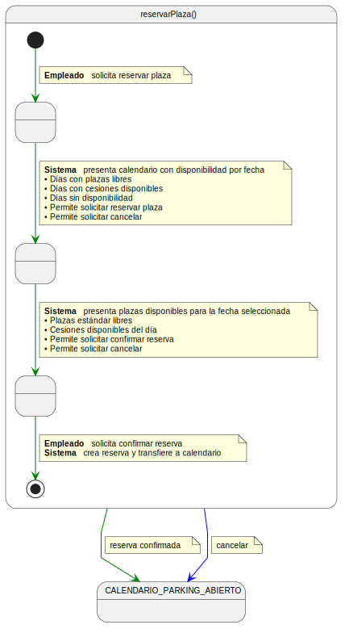
[Código fuente](../../modelosUML/puml/cuReservarPlaza.puml)

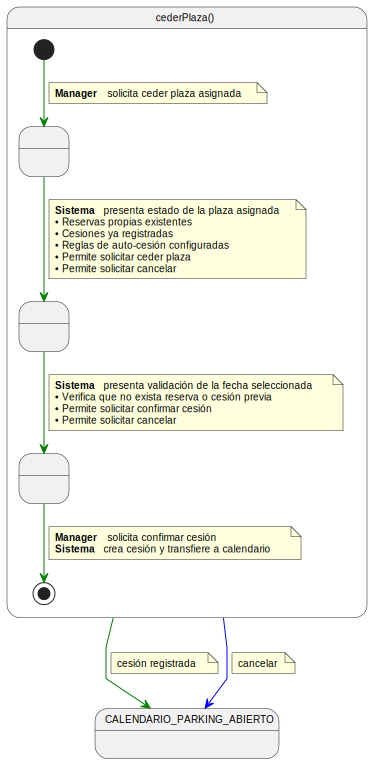
[Código fuente](../../modelosUML/puml/cuCederPlaza.puml)

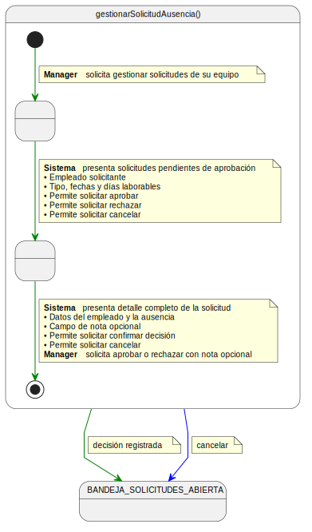
[Código fuente](../../modelosUML/puml/cuGestionarSolicitudAusencia.puml)

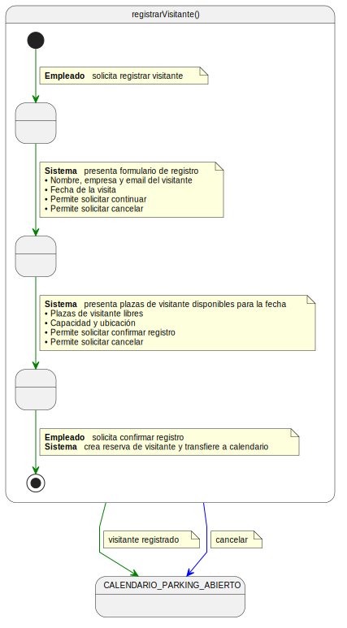
[Código fuente](../../modelosUML/puml/cuRegistrarVisitante.puml)

### 2.3.4. Prototipos de interfaz

Los prototipos de baja fidelidad validan la correspondencia entre los casos de uso detallados y la interfaz del sistema. Se presentan como wireframes funcionales centrados en la estructura de la pantalla y el flujo de interacción, no en el diseño visual final.

**Reservar plaza**: Vista de dos paneles: calendario mensual con indicación de disponibilidad por día en la columna izquierda y lista de plazas disponibles para la fecha seleccionada en la derecha, con acción de confirmación.

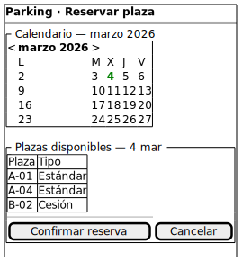
[Código fuente](../../modelosUML/puml/protoReservarPlaza.puml)

**Ceder plaza**: Vista centrada en la plaza asignada del manager, con selector de fecha y acción de cesión directa.

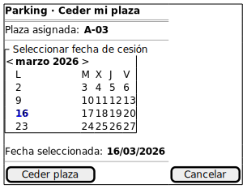
[Código fuente](../../modelosUML/puml/protoCederPlaza.puml)

**Aprobar solicitud de ausencia**: Vista de dos zonas: tabla de solicitudes pendientes del equipo en la parte superior y panel de detalle con decisión de aprobación o rechazo con nota en la parte inferior.

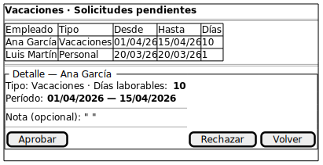
[Código fuente](../../modelosUML/puml/protoAprobarSolicitudAusencia.puml)

**Registrar visitante**: Formulario estructurado en dos bloques: datos del visitante y detalles de la visita (fecha y selección de plaza), con acción de registro y envío automático de confirmación.

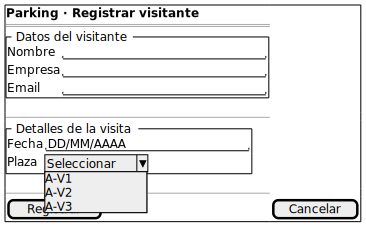
[Código fuente](../../modelosUML/puml/protoRegistrarVisitante.puml)

### 2.3.5. Diagrama de contexto

El diagrama de contexto expresa el sistema como una máquina de estados en la que cada estado representa una vista del portal y cada transición corresponde a un caso de uso que lleva al usuario de una vista a otra. `SESION_CERRADA` es el estado de entrada; `SISTEMA_DISPONIBLE` actúa como hub central desde el que se accede a todos los módulos. Los estados siguen el patrón `X_ABIERTO` para vistas de listado y edición, con transiciones autorreflexivas para operaciones que no cambian de contexto. El retorno desde cualquier estado al hub central se unifica mediante `completarGestion()`. Los servicios externos (Entra ID y Microsoft Graph) no aparecen como estados porque colaboran desde la capa de aplicación.

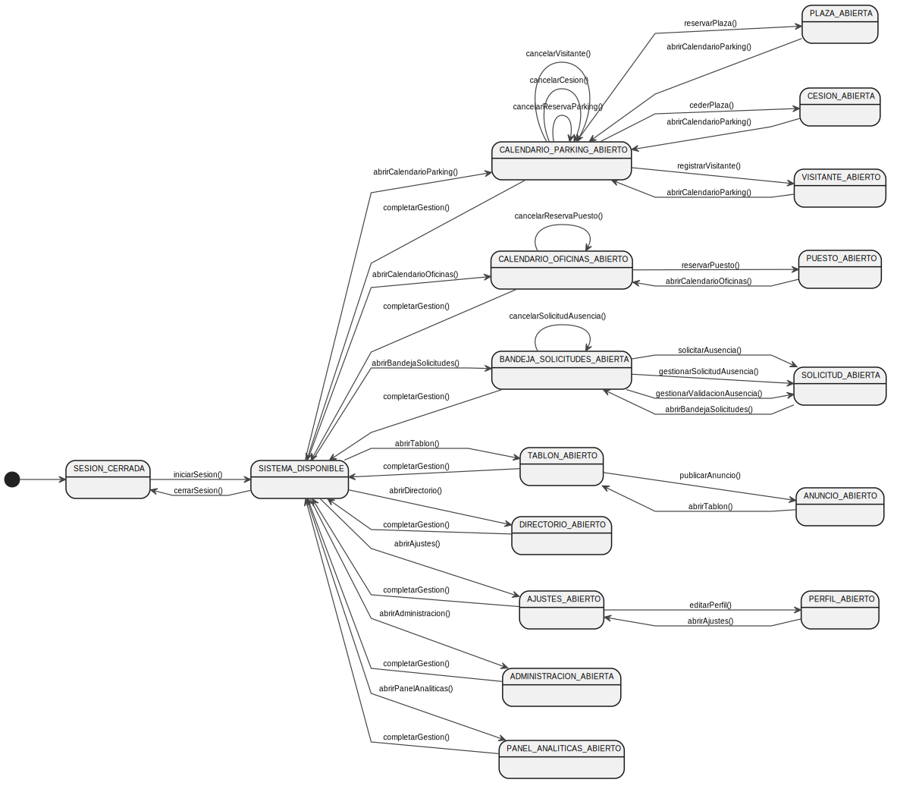
[Código fuente](../../modelosUML/puml/contexto.puml)

## 2.4. Requisitos no funcionales

Los requisitos no funcionales especifican propiedades del sistema que trascienden la funcionalidad individual de cada caso de uso.

| ID     | Categoría            | Descripción                                                                                                                                               |
| ------ | -------------------- | --------------------------------------------------------------------------------------------------------------------------------------------------------- |
| RNF-01 | Rendimiento          | Las operaciones de reserva y cancelación responderán en menos de 2 segundos bajo carga normal de uso.                                                     |
| RNF-02 | Disponibilidad       | El sistema estará disponible el 99,5 % del tiempo en horario laboral (L-V, 07:00-21:00).                                                                  |
| RNF-03 | Seguridad            | La autenticación se delega en Microsoft Entra ID mediante OAuth 2.0/OIDC. No se almacenan contraseñas para cuentas M365.                                  |
| RNF-04 | Seguridad            | La autorización se gestiona en la capa de aplicación mediante guardas de rol. Ningún dato de una entidad es visible para usuarios de otra entidad.        |
| RNF-05 | Usabilidad           | La interfaz será responsiva y utilizable desde dispositivos móviles sin necesidad de aplicación nativa.                                                   |
| RNF-06 | Mantenibilidad       | La arquitectura modular permitirá añadir o desactivar módulos sin modificar el código base existente.                                                     |
| RNF-07 | Portabilidad         | El sistema se desplegará sobre infraestructura estándar (PostgreSQL, Node.js) sin dependencia de un proveedor cloud concreto.                             |
| RNF-08 | Notificaciones       | El sistema enviará notificaciones de confirmación y recordatorio a través de Microsoft Teams o correo electrónico según las preferencias de cada usuario. |
| RNF-09 | Internacionalización | La interfaz estará disponible en español. La arquitectura soportará la incorporación de otros idiomas sin cambios estructurales.                          |
